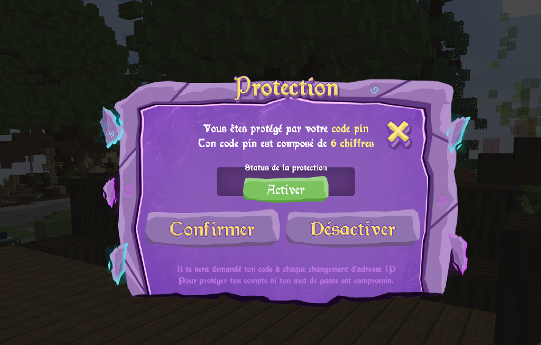

# Comment changer son mot de passe sur le site / en jeu

#### Sur Nexion, il y a deux authentifications par un mot de passe. Le premier se trouve avec votre compte sur le site et le second est un mot de passe sur le jeu.

Deux authentifications te permettent de protéger ton compte deux fois, donc profites-en pour ne pas mettre le même mot de passe, ainsi tu peux mettre un mot de passe unique jamais créé ailleurs.


Ainsi pour renforcer la sécurité de votre compte, vous devez obligatoirement utiliser un mot de passe unique que vous n'avez jamais utilisé auparavant sur un autre site.&#x20;

Nous vous conseillons d'**utiliser un mot de passe généré aléatoirement**, il existe plusieurs générateurs de mot de passe disponibles sur internet, vous pouvez chercher par vous même, ou cliquer sur celui que nous vous proposons ci-dessous.

· **Dashlane** - [https://www.dashlane.com/fr/features/password-generator](https://www.dashlane.com/fr/features/password-generator)


## Changer son mot de passe sur le site


**Etape 1 ->** Aller sur le site de <mark style="color:purple;">**NEXION**</mark> et sur <mark style="color:purple;">**MON COMPTE**</mark> en haut à droite

**Etape 2 ->** Vous pouvez changer directement votre mot de passe en indiquant votre mot de passe actuel ainsi que votre nouveau mot de passe et sa confirmation.


.png>)

## Changer son mot de passe en jeu


**Etape 1 ->** Connecte-toi au launcher comme indiqué dans [3.-commencer-a-jouer.md](../../welcome/installer-et-jouer/3.-commencer-a-jouer.md "mention")

**Etape 2 ->** Une fois dans un LOBBY tu dois simplement taper la commande suivante :&#x20;

<mark style="color:purple;">**/mdp \<Ancien mot de passe> \<Nouveau mot de passe>**</mark>


.png>)

## Comment activer son double authentification


**Etape 1 ->** Connecte-toi au launcher comme indiqué dans [3.-commencer-a-jouer.md](../../welcome/installer-et-jouer/3.-commencer-a-jouer.md "mention")

**Etape 2 ->** Une fois dans un LOBBY tu dois simplement taper la commande suivante :&#x20;

<mark style="color:purple;">**/2FA**</mark>&#x20;

**Etape 3 ->** Créer votre code PIN et souvenez-vous en ! (NOTEZ-LE)



**INFORMATIONS** \
**->** Vous pouvez modifier votre code pin en mettant votre code pin, et le désactiver et activer quand vous le souhaitez. Il n'est pas recommandé de le désactiver.\
&#x20;**->**Il vous sera demandé votre CODE PIN uniquement lors d'un changement de votre adresse IP.

