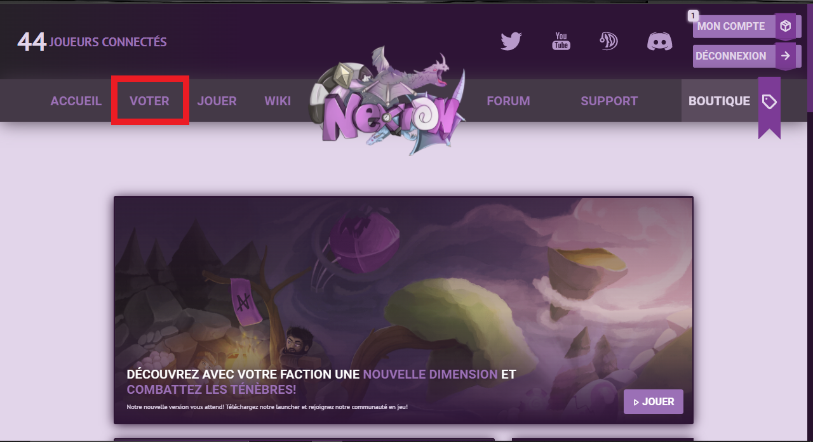
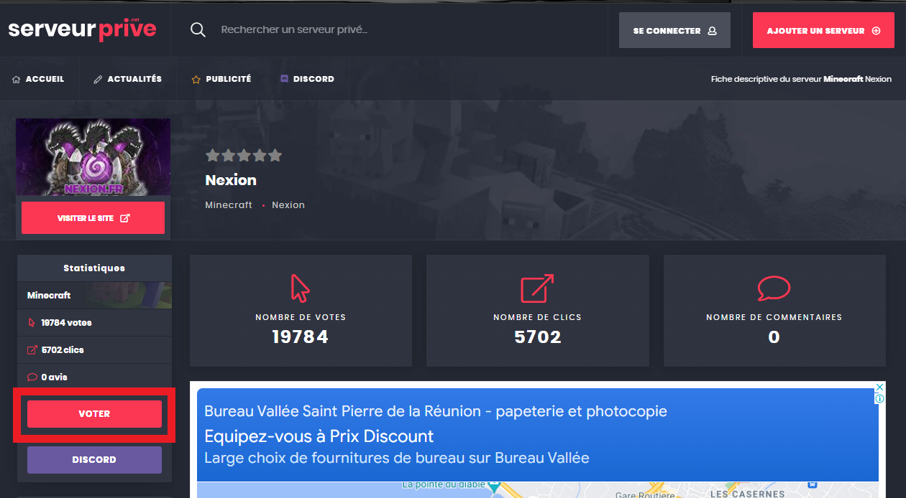
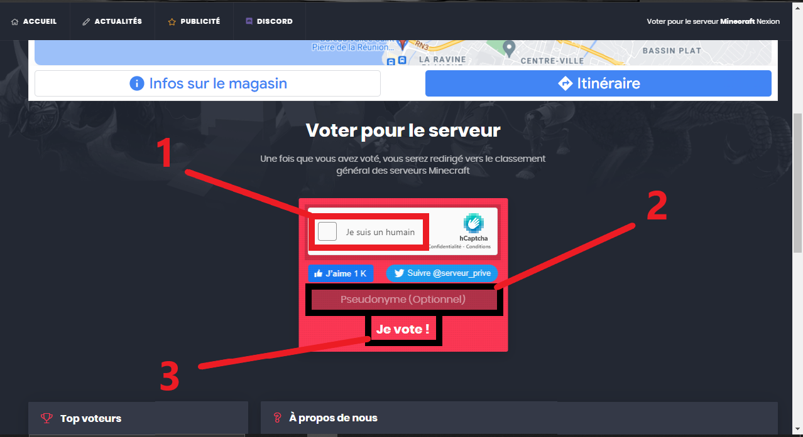
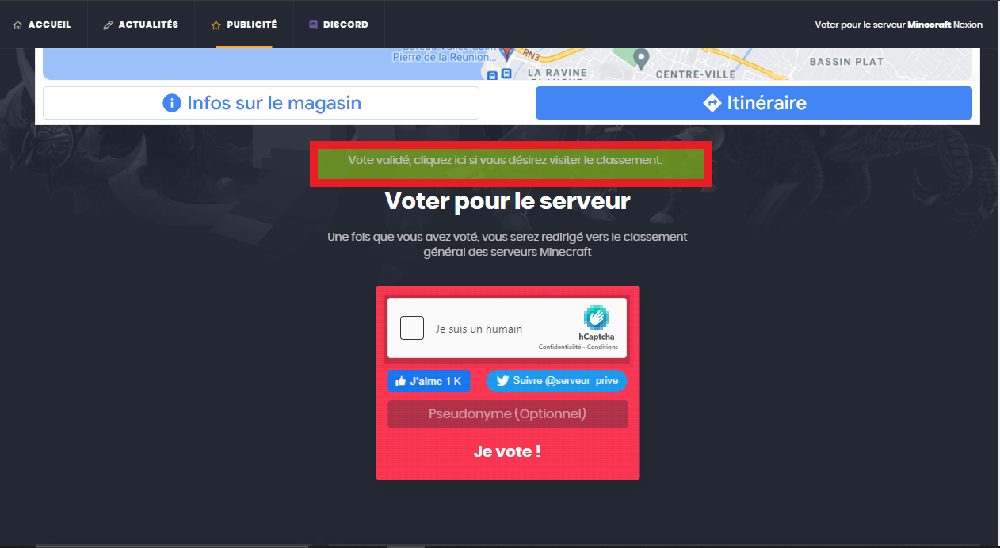
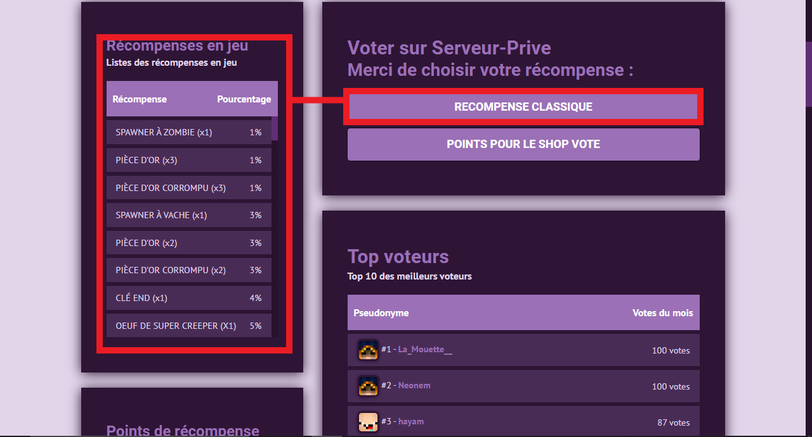
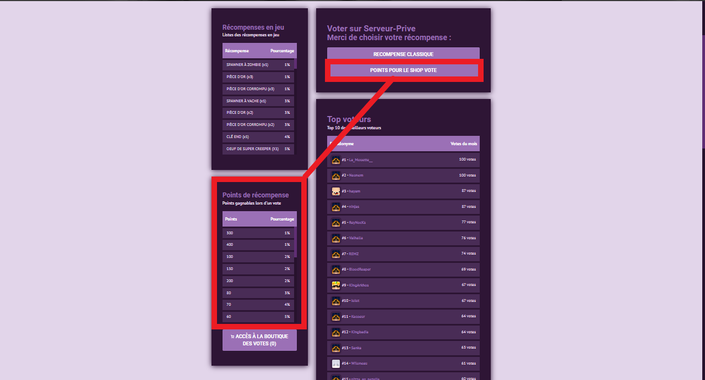

# Guide pour voter et recevoir des récompenses

#### En votant sur <mark style="color:purple;">Nexion</mark> cela vous permettra d'obtenir divers récompenses en jeu&#x20;

Pour voter rends toi sur notre site [https://nexion.fr/](https://nexion.fr/) et clique sur **VOTER**&#x20;

Clique ensuite sur **VOTE SUR SERVEUR-PRIVE**

Vous allez être redirigés vers un autre site et une fois sur le site cliquer à nouveau sur **VOTER**

.png>) 

Une fois que tu as cliquer sur VOTER tu devras :&#x20;

* **Valide le captcha **<mark style="color:red;">**(1)**</mark>
* **Écrire ton pseudo si tu le souhaites **<mark style="color:red;">**(2)**</mark>
* **Une fois le captcha** **valider cliquer sur Je vote ! **<mark style="color:red;">**(3)**</mark>

 

Retourner maintenant sur la page de NEXION :&#x20;

* **Valide le captcha **<mark style="color:red;">**(1)**</mark>
* **Une fois le captcha** **validé cliquer sur VÉRIFIER MON VOTE **<mark style="color:red;">**(2)**</mark>

.png>)

Deux choix s'offrent à toi une **RÉCOMPENSE CLASSIQUE** ou **DES POINTS POUR LE SHOP VOTE**

 

#### Si tu choisis une **RÉCOMPENSE CLASSIQUE** pour la récupérer ta récompense :&#x20;


<mark style="color:blue;">**INFO :**</mark>&#x20;

Tu dois être connecté sur le faction et cliquer sur **RÉCUPÉRER MES RÉCOMPENSES EN ATTENTE**&#x20;


.png>)


<mark style="color:red;">**IMPORTANT**</mark>

Lorsque tu récupères tes récompenses et que ton inventaire est plein, le surplus d'item sera stocké dans [ta mailbox](../../systeme-a-connaitre/mailbox.md) hormis les kits qui eux seront drop au sol&#x20;


#### Si tu choisis **DES POINTS POUR LE SHOP VOTE**


<mark style="color:blue;">**INFORMATION**</mark>

Pour accéder au shop vote descend en bas de la page de vote et clique sur [**ACCÈS À LA BOUTIQUE DES VOTES**](https://nexion.fr/vote/shop)

En haut à gauche se trouve le nombre point shop dont tu disposes&#x20;

Tu dois être connecté en faction pour pouvoir acheter une récompense


 

### Chaque fin de mois les 5 premiers du top vote sont récompensé avec des points boutique donc n'hésitez pas à voter !


#### <mark style="color:green;">**RÉCOMPENSE :**</mark>

* **1er :** 3000 points boutique&#x20;
* **2ème :** 2500 points boutique
* **3ème :** 2000 points boutique&#x20;
* **4ème :** 1500 points boutique
* **5ème :** 1000 points boutique&#x20;


Tu peux consulter le Top 50 des meilleurs voteurs directement sur la page de vote [https://nexion.fr/vote](https://nexion.fr/vote)
