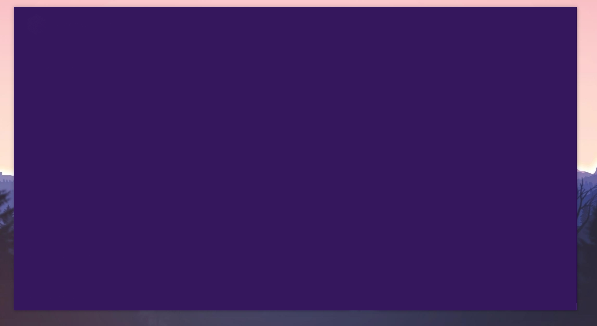

# Résolution des problèmes sur le launcher

#### Tu as essayé <mark style="color:purple;">d'installer le launcher mais tu as une erreur ou un problème</mark> et tu rencontres des difficultés pour jouer alors tu es au bon endroit !

Premièrement, il existe plusieurs solutions aux problèmes de launcher en fonction de ce que tu as comme erreur, que ce soit avant de lancer le jeu, pendant le lancement du jeu ou même après le lancement du launcher. Tout sera expliqué, si tu vois ton problème va suivre le tutoriel pour le résoudre.


<mark style="color:red;">Avant d'aller voir les différentes solutions assure-toi d'avoir regardé le tutoriel permettant de savoir tout sur le :</mark> [<mark style="color:red;">**\[ -> Téléchargement du jeu \]**</mark>](../../welcome/installer-et-jouer/commencer-son-aventure-des-maintenant.md)


[<mark style="color:purple;">**-> Erreur 503 : Launcher**</mark>](guide-launcher.md#erreur-503-launcher)

[<mark style="color:purple;">**-> Erreur 666 : Launcher**</mark>](guide-launcher.md#erreur-666-launcher)

[<mark style="color:purple;">**-> Error : Network**</mark> ](guide-launcher.md#error-network)

[<mark style="color:purple;">**-> Launcher sans affichage**</mark>](guide-launcher.md#launcher-sans-affichage)

[<mark style="color:purple;">**-> Erreur : " Authentification en cours… " ou "Connexion impossible !"**</mark>](guide-launcher.md#erreur-authentification-en-cours...-ou-connexion-impossible)

[<mark style="color:purple;">**-> Erreur : " En attente de lancement"**</mark> ](guide-launcher.md#erreur-en-attente-de-lancement)

[<mark style="color:purple;">**-> Erreur : " Pixel format not accelerated "**</mark> ](guide-launcher.md#erreur-pixel-format-not-accelerated)

[<mark style="color:purple;">**-> Comment transmettre son code erreur ?**</mark>](guide-launcher.md#comment-transmettre-son-code-erreur)

## Erreur 503 : Launcher

Un code erreur au lancement du téléchargement du jeu 503, alors tu peux suivre ce tutoriel :&#x20;


1. Appuyer simultanément sur les touches **Windows + R** de votre clavier
2. Dans la fenêtre qui s'affiche saisir : **%appdata%** et valider par **\[OK]**
3. Supprimer ensuite le dossier **.nexiongames**
4. Ensuite dans votre barre de recherche **Windows** rechercher le **Panneau de configuration**
5. Dans l'onglet **Programmes**, cliquez sur **Désinstaller un programme**
6. Désinstaller le programme **NexionGames 1.0.X**
7. Aller sur le site [<mark style="color:purple;">**nexion.fr/join**</mark>](https://nexion.fr/join) pour **télécharger** le nouveau launcher


## Erreur 666 : Launcher

Un code erreur au lancement du jeu avec le code erreur 666, il te suffit simplement de retirer ton VPN, nous n'acceptons pas les connexions sous d'autres connexions que la tienne. Si tu n'as pas de VPN et que tu as tout de même ce code erreur, tente de mettre en quarantaine ton anti-virus et de relancer NexionGames, ton pare-feu peut parfois bloquer ta connexion.

## Error : Network

Erreur peu connu, mais c'est simplement l'erreur que tu peux avoir lorsque tu n'as pas de connexion assez puissante permettant de lancer notre launcher, alors vérifie ta connexion internet, et si le problème persiste tu peux voir directement cela avec ton Fournisseur d'Accès à Internet.

## Launcher sans affichage

<figure><figcaption></figcaption></figure>

Si tu ouvres ton launcher est que celui-ci est sans affichage. Tu dois désinstaller le launcher en suivant les étapes suivantes


1. Appuie sur la touche **Windows** recherche **Panneau de configuration**&#x20;
2. Ensuite dans : **Désinstaller un programme**
3. Cherche le launcher **NexionGames**
4. Clique-droit sur le launcher et **Désinstaller**


Maintenant tu dois télécharger le launcher ci-dessous et tu n'auras plus le problème d'affichage.

[https://www.dropbox.com/s/je410cyfqut941g/NexionGames%20Setup%201.0.10%20Secondaire.exe?dl=0](https://www.dropbox.com/s/je410cyfqut941g/NexionGames%20Setup%201.0.10%20Secondaire.exe?dl=0)

## Erreur : " Authentification en cours… " ou "Connexion impossible !"

Tu as réussi à lancer le launcher, mais manque de chance tu as un chargement qui n'aboutit pas, lorsque tu cliques sur " Rejoindre l'aventure " ne t'en fais pas ça peut arriver, notre système d'anti-bot te bloque, alors suis ce tutoriel pour te débloquer :&#x20;


1. Appuie sur la touche **Windows** recherche **Panneau de configuration**&#x20;
2. Recherche : **Réseau & internet**
3. Clique sur : **Centre Réseau et partage**
4. À gauche clique sur : **Modifier les paramètres de la carte**
5. Repère la WI-FI ou la 4G que tu utilises. _(avec les petites barres vertes)_
6. Fais un clique-droit et appuie sur : **Propriétés**
7. Désactive la case : **Protocole Internet version 6 (TCP/IPv6)**
8. Si tu as le moindre problème au bout de 30 secondes, alors re-coche la case
9. Appuie sur **\[OK]** (Il se peut que cela te déconnecte pendant quelques secondes)&#x20;
10. Tu peux relancer le launcher de Nexion complètement et te connecter


Si le problème n'est pas résolu, **ouvre un ticket sur le support** et explique-nous ce qu'il se passe avec ton code erreur précisément [<mark style="color:purple;">**-> https://nexion.fr/support**</mark>](https://nexion.fr/support)

## Erreur : " En attente de lancement "

Plusieurs solution possible pour corriger ce problème, la plus simple d'être elle est de simplement d'appuyer sur le serveur que tu souhaites sélectionner ici il faut bien cliquer sur le logo de Nexion se trouvant à droites du bouton Accueil. Les logos en dessous de "Nos projets" redirige vers les sites internet des projets.


<mark style="color:red;">Je t'invite à regarder le tutoriel permettant de savoir tout sur le :</mark>\
[<mark style="color:red;">**\[ -> Téléchargement du jeu \]**</mark>](../../welcome/installer-et-jouer/commencer-son-aventure-des-maintenant.md) <mark style="color:red;">cela t'explique aussi le launcher !</mark>


.png>)

Pour les autres cas, cela peut dépendre de beaucoup de problèmes, il va falloir suivre étape par étape pour les instructions et avoir une résolution du problème optimal :&#x20;


<mark style="color:green;">Identifions dans un premier temps le problème</mark>&#x20;

1. Appuyer simultanément sur les touches **Windows + R** de votre clavier
2. Dans la fenêtre qui s'affiche saisir : **%appdata%** et valider par **\[OK]**
3. Ouvre ensuite le dossier **.nexiongames**
4. Dans le dossier ouvre le fichier se nommant **" latest"**
5. Dans le fichier appuie simultanément sur les touches **CTRL + F**
6. Dans l'onglet qui s'ouvre **" Rechercher "** met le texte suivant : **Pixel format**
7. Dans le cas ou tu as un résultat, nous avons repéré le problème
8. [<mark style="color:green;">**\[ -> CLIQUE Passons maintenant à la résolution de l'erreur ! \]**</mark>](guide-launcher.md#erreur-pixel-format-not-accelerated)
9. Dans le cas ou tu n'as pas de résultat, nous n'avons pas trouvé le problème
10. [<mark style="color:red;">**\[ -> CLIQUE Pour nous transmettre ton code erreur \]**</mark>](guide-launcher.md#undefined)


## Erreur : Pixel format not accelerated

Ce message d'erreur est généralement causé par des pilotes de carte vidéo obsolètes. Pour résoudre ce problème, vous devez généralement mettre à jour les pilotes de votre carte vidéo, veuillez suivre les instructions ci-dessous pour votre système d'exploitation.


<mark style="color:green;">Solution n°1</mark>

Suivre le tutoriel sur le forum :&#x20;

1. Appuyer simultanément sur les touches **Windows + R** de votre clavier
2. Dans la fenêtre qui s'affiche saisir : **devmgmt.msc** et valider par **\[OK]**
3. Une page se nommant : **"Gestionnaire des périphériques"** s'ouvre
4. Ouvrir l'onglet : **"Cartes graphiques"** en cliquant sur la flèche à sa gauche
5. Faire un **CLIQUE-DROIT** sur la carte graphique visible&#x20;
6. Puis clique sur : **"Mettre à jour le pilote"**
7. Ensuite clique sur "**Rechercher automatiquement le logiciel de pilote à jour**"
8. Après le chargement clique sur **FERMER**
9. Maintenant tu peux relancer le launcher de Nexion

[<mark style="color:green;">**\[ -> Plus d'explications sur le forum avec des images \]**</mark> ](https://nexion.fr/forum/threads/r%C3%A9gler-le-probl%C3%A8me-de-launcher-qui-crash-au-lancement.539/)

Si celui-ci ne résous pas le problème, suivez la : Solution n°2&#x20;



<mark style="color:green;">Solution n°2</mark>

1. Appuyer simultanément sur les touches **Windows + R** de votre clavier
2. Dans la fenêtre qui s'affiche saisir : **dxdiag** et valider par **\[OK]**
3. Lorsqu'une fenêtre DxDiag s'ouvre, accédez à l'onglet " **Affichage** "
4. Recherchez la partie Nom et Nom du fabricant.&#x20;
5. Une fois que vous avez trouvé cela, recherchez votre fabricant dans la liste ci-dessous et accédez à leur site " Auto-Detector " et analysez votre ordinateur à la recherche de pilotes obsolètes.

* AMD / ATI : [http://support.amd.com/fr/download/auto-detect-tool](https://www.amd.com/fr/support)
* NVIDIA : [https://www.nvidia.com/Download/Scan.aspx?lang=fr](https://www.nvidia.com/Download/Scan.aspx?lang=fr)
* Intel : [https://www.intel.fr/content/www/fr/fr/support.html](https://www.intel.fr/content/www/fr/fr/support.html)

* Si vous en trouvez un, installez-le
* Si, pour une raison quelconque, aucune mise à jour n'est disponible ou si les mises à jour ne résolvent pas votre problème, veuillez [obtenir un rapport DxDiag](https://minecrafthopper.net/help/dxdiag)\
  \



## Comment transmettre son code erreur ?

Il est possible que malgré nos solutions proposés tu te retrouves avec une nouvelle erreur, un code que nous ne voyons que rarement de fois, ça peut arriver en effet. Pour cela nous faisons problème par problème puisque certains peuvent être unique à un joueur, pour cela suis le tutoriel :&#x20;



1. Appuyer simultanément sur les touches **Windows + R** de votre clavier
2. Dans la fenêtre qui s'affiche saisir : **%appdata%** et valider par **\[OK]**
3. Ouvre ensuite le dossier **.nexiongames**
4. Dans le dossier ouvre le fichier se nommant **" latest"**
5. Appuie sur les touches **CTRL + A** cela sélectionne tout le contenu
6. Et maintenant appuie sur les touches **CTRL + C** cela permet de copier le contenu
7. Rends-toi sur le site suivant : [<mark style="color:purple;">**https://pastebin.com/**</mark>](https://pastebin.com/)
8. Dans le champs de saisie **" NEW PASTE "**
9. Appuie sur les touches **CTRL + V** permettant de coller le contenu préalablement copié
10. Descend/Scroll en bas de page pour cliquer sur le bouton **\[CREATE NEW PASTE]**
11. Tu as créé ton pastebin, maintenant **copie l'URL** et transmet la dans ton ticket support.

L'url doit être sous cette forme : [<mark style="color:purple;">**https://pastebin.com/fcXacxbp**</mark>](https://pastebin.com/fcXacxbp)

**Ouvre un ticket sur le support** et donne ton pastebin en expliquant ton problème et ce que tu as exécuté comme solution [<mark style="color:purple;">**-> https://nexion.fr/support**</mark>](https://nexion.fr/support)


