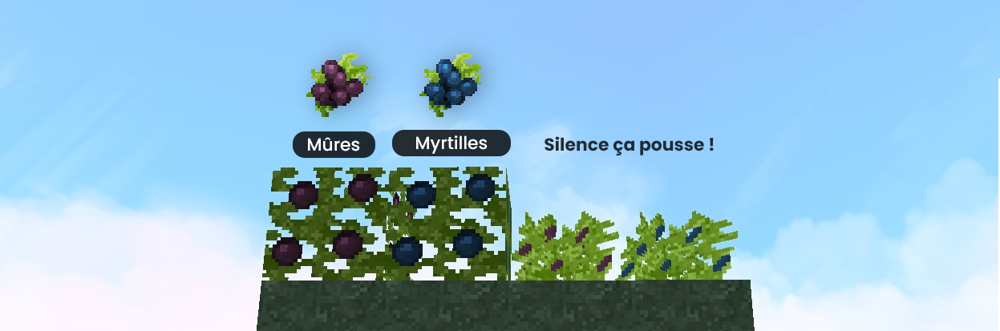

# 👨🌾 Farming

## Tu n'as pas peur de toucher la terre ? <mark style="color:purple;">Retrousse tes manches pixelisées, tu en auras bien le besoin.</mark> Par ici, nous allons voir l'art de Farming !

Sur le jeu Minecraft, tu dois déjà connaître les plantations de patates, ou bien même de carottes, ou même de blés, tu as compris, je ne vais pas faire toutes les plantations possibles du jeu. De notre côté, nous nous sommes dits, il n'y a pas assez de choses. Oui, nous sommes peut-être un peu fou. Mais je t'assure, tu risques d'y prendre goût et de fortement apprécier, alors passe à la suite !

***

### **Le buisson de **<mark style="color:purple;">**Mûres**</mark>** ainsi que le buisson de **<mark style="color:blue;">**Myrtilles**</mark>.&#x20;

<figure><figcaption></figcaption></figure>



Les buissons de mûres et de myrtilles sont **trouvables dans la nature sur le serveur Faction comme sur les serveurs Minage.** En te baladant tu risque de tomber sur un buisson, alors n'hésite pas à le ramasser il te sera utile pour ton aventure !



Tu dois simplement **planter le buisson sur de l'herbe ou de la terre**. .png>)\
Ils n'ont pas besoin d'eau, ni même de lumière pour pousser. On dirait que c'est une plante qui pousse comme pour magie…&#x20;



Pour récolter plus facilement le buisson tu peux utiliser une **faucille en Titane**. .png>)




<mark style="color:green;">**Astuce**</mark>

Vous pouvez casser vos récoltes avec l'outil **houe de replantation**, cet outil permet de replanter automatiquement vos agricultures seulement si vous avez la ressource en question dans votre inventaire permettant d'être planté. Cela fonctionne de la même manière avec la **houe de Drahe** mais qui applique la replantation automatique dans une zone 3\*3 c'est un outil légendaire obtenable avec [guldor.md](personnage-fictif/guldor.md "mention")



En <mark style="color:red;">1</mark>, le <mark style="color:purple;">Tabac</mark>  la plante est disponible dans le camp de gobelins en <mark style="color:orange;">Warzone</mark>. Il faut obligatoirement un <mark style="color:red;">Gant de jardinage</mark> pour pouvoir récupérer du tabac !



Dans les camps gobelins de Holbeck, une <mark style="color:orange;">nouvelle ressource</mark> est disponible, la menthe ! Il faut obligatoirement un <mark style="color:red;">Gant de jardinage</mark> pour pouvoir récupérer la menthe !&#x20;



En <mark style="color:red;">2</mark>, le <mark style="color:purple;">buisson moisie.</mark> il est disponible dans [la dimension](la-nouvelle-dimension.md#les-zones), dans [les cimetières](les-evenements/cimetieres.md). La faucille abyssale peux être utilisée pour dupliquer le loot en cassant les buissons moisies.\
Il peux être <mark style="color:orange;">craft</mark> dans le puit de création pour pouvoir <mark style="color:red;">en avoir</mark> dans vos bases ! (vous pouvez regarder le craft avec [L'archimage](personnage-fictif/archimage.md))\
Il vous faudra une <mark style="color:red;">faucille abyssale</mark> pour récupérer des germes moisies !


<mark style="color:purple;">Le buisson</mark> est l'agriculture principale de nexion, il possède <mark style="color:purple;">3 niveaux</mark>&#x20;

Entre <mark style="color:red;">3</mark> et <mark style="color:red;">8</mark>, les buissons de baies, possèdent 3 niveaux :&#x20;

**En vert, les buissons (buissons) de "niveau 0"** sont trouvables à la surface des serveurs minages et du serveur faction et ont pour loot les <mark style="color:purple;">mûres</mark> ( pour les plantations vertes et violettes ) ou <mark style="color:purple;">myrtilles</mark> ( pour les plantations vertes et bleues ).


_<mark style="color:orange;">**Remarque :**</mark>_&#x20;

Vous pouvez aussi faire des graines de melons et de pastèques de niveaux 1 et 2. Et comme pour les buissons si vous cassez une pastèque de niveaux 2 vous avec 15% de chance d'obtenir <mark style="color:purple;">une pastèque légendaire</mark>. Idem pour les citrouilles.



_<mark style="color:red;">**Attention !**</mark>_&#x20;

Une graine de pastèque/citrouille de niveaux 1 et 2 en font pousser 4, 1 dans toutes les directions !


**En jaune, les buissons (bushs) niveau 1,** sont les améliorations des bushs de niveaux 1. La différence notable, est qu'ils sont minables <mark style="color:purple;">beaucoup plus rapidement</mark> avec une faucille en titane, que les buissons niveau 0.&#x20;

**En rouge, les buissons (bushs) niveau 2,** sont minables également beaucoup plus rapidement que les buissons niveau 0. Mais à la différence des buissons niveau 1, ceux-ci ont une chance de vous dropper <mark style="color:purple;">des baies légendaires</mark>, qui se vendent très cher au /shop, et qui sont très utiles pour monter le niveau de [magie](la-magie.md), quand ceux-ci sont droppées dans le puit magique en sacrifice.

### L'évolution


_<mark style="color:orange;">**Remarque :**</mark>_

**Pour augmenter les plantations de niveau 0 en niveau 1,** vous aurez besoin d'une poudre légendaire de niveau 1 et pour cela il vous faut : 1 fragment de gemme de mana entouré de 8 stacks de poudre d'os, en craftant dans la table de craft gemmée.&#x20;

**Pour augmenter les plantations de niveau 1 en niveau 2,** vous aurez besoin d'une poudre légendaire de niveau 2 et pour cela il vous faut : 1 gemme de mana entourée de 8 stacks de poudre d'os, tout en craftant dans la table de craft gemmée.


 (1).png>)

.png>)

Maintenant que la poudre est craftée vous pouvez faire un clic droit sur le buisson/graine de votre choix, il n'y a pas 100% de chance de transformation donc il faut utiliser plusieurs fois la poudre pour le monter de niveau.&#x20;


_<mark style="color:red;">**Attention !**</mark>_

Une poudre de niveau 2 ne peux être utilisée que sur des buissons de niveau 1 !

