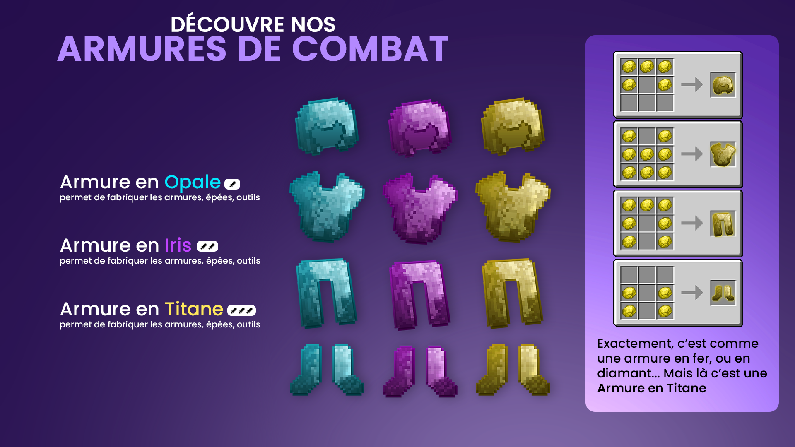
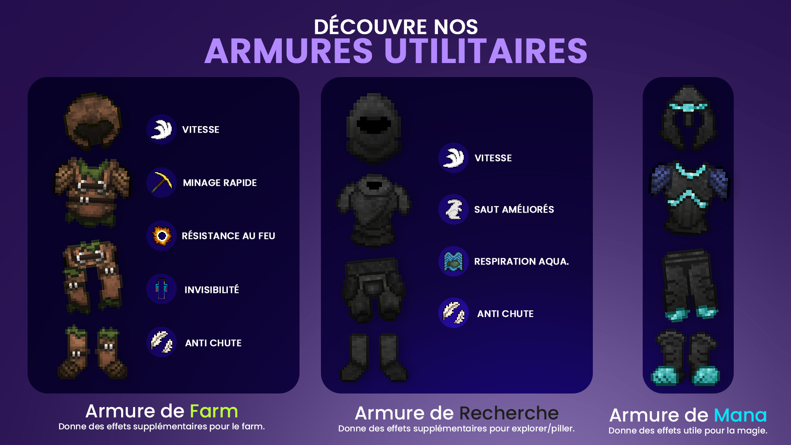

# Armures

<figure><figcaption></figcaption></figure>

<figure><figcaption></figcaption></figure>

<figure><figcaption></figcaption></figure>

## Les armures améliorées


• **ARMURES AMELIOREES DE **<mark style="color:red;">**VIE**</mark>** :**  | \
Chaque pièce d'armure de vie vous <mark style="color:red;">donne 1/2 cœur supplémentaire</mark>.

• **ARMURES AMELIOREES DE **<mark style="color:green;">**REPARATION**</mark>** :**  | \
Elle se répare automatiquement lorsque vous <mark style="color:green;">gagnez de l'expérience</mark>.

• **ARMURES AMELIOREES DE **<mark style="color:blue;">**METAL**</mark>** :**  | \
Elle possède <mark style="color:blue;">plus de durabilité</mark> que l'armure de base

• **ARMURES AMELIOREES DE **<mark style="color:orange;">**TERRE**</mark>** :** .png>).png>) | \
Elle est <mark style="color:orange;">plus résistante</mark> que l’armure de base


Les armures en titane et iris sont améliorables avec des gemmes.\
Selon les gemmes utilisées, les effets sont différents. _**Attention**_, les fabrications d'armures gemmées se font désormais dans la table de fabrication gemmée.

## Les armures légendaires

Il existe trois meilleures armures sur Nexion. Elles sont difficiles à acquérir. Pour les chanceux qui peuvent réussir à en avoir, chaque armure lorsqu'elle est portée entièrement vous donne les effets suivants :&#x20;


• **ARMURE LEGENDAIRE DE** **MENOS** **:** .png>).png>).png>).png>)\
Elle offre les effets suivants : Résistance au feu - Anti chute - Force II - Vitesse II \
Elle permet aussi d'avoir 20% de dégâts aux armures de Vascur

• **ARMURE LEGENDAIRE DE** **VASCUR :** \
Elle offre les effets suivants : Résistance au feu - Anti chute - Force II - Vitesse II \
Elle permet aussi d'avoir 20% de dégâts aux armures de Menos\
Et permet avec 5% de chance de donner un effet de Wither à l'ennemi qui vous frappe.

• **ARMURE LEGENDAIRE DE MAXAR :** \
Elle offre les effets suivants : Résistance au feu - Anti-Chute - Force II - Vitesse II - Invisibilité

