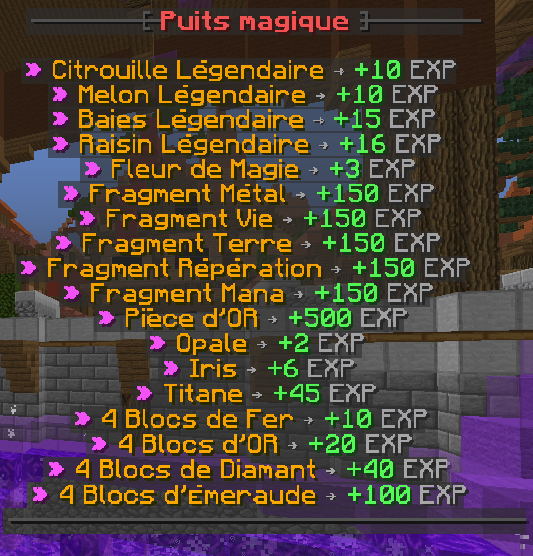
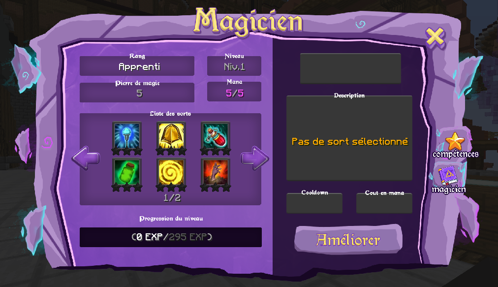
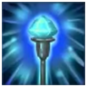
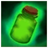
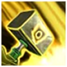

# 🧙 Magie

## Débloquer la magie&#x20;


La magie est accessible au <mark style="color:purple;">niveau 30</mark> de votre classe. Pour maximiser la Magie, il vous faudra la monter <mark style="color:purple;">niveau 125</mark>.



Le seul moyen d'xp votre magie est de lancer des sort ou de faire des offrandes au puit magique. (Vous pouvez aussi avoir des artéfacts de magie !)\
Tout les <mark style="color:purple;">25 niveau de magie</mark>, une Baguette magique vous est donné !


Voici l'interface de sort _**/sort**_

## Liste des sorts

### Le sort de <mark style="color:purple;">**Transformation**</mark> : permet de transformer le minerai aléatoire en minerai aléatoire gemmé. (Random Ore -> Random Ore Gemées)

* Niveau 1 : 50% de chance
* Niveau 2 : 65% de chance
* Niveau 3 : 80% de chance

### Le sort de <mark style="color:purple;">**Réparation**</mark>  : permet de réparer l'armure équipé.

* Niveau 1 : répare 200 de durabilité
* Niveau 2 : répare 400 de durabilité
* Niveau 3 : répare 600 de durabilité

### Le sort de <mark style="color:purple;">**Guérison**</mark>  : permet de rendre de la vie.

* Niveau 1 : Rend 4 point de vie
* Niveau 2 : Rend 6 point de vie
* Niveau 3 : Rend 10 point de vie

### Le sort de <mark style="color:purple;">**2XP**</mark>  : permet de doubler l'expérience Minecraft reçu pendant un certain temps.

* Niveau 1 : 10 min
* Niveau 2 : 20 min
* Niveau 3 : 30 min

### Le sort <mark style="color:purple;">**Omniscient**</mark>  : permet de détecter les coffres aux alentours de vous en donnant un pourcentage.

* Niveau 1 : 10 blocs
* Niveau 2 : 20 blocks
* Niveau 3 : 30 blocs

### Le sort <mark style="color:purple;">**Anti-trap**</mark> : permet de sortir d'une trap en se téléportant au dernier joueur qui vous a tapé(dans un délais). Mais cela, uniquement si ce joueur peut vous frapper(via des blocs transparent ou de l'air) et que vous le regardez.

* Niveau 1 : délais du dernier combat -> 2sec
* Niveau 2 : délais du dernier combat -> 3sec
* Niveau 3 : délais du dernier combat -> 4sec\

### Le sort de <mark style="color:purple;">**Replantation**</mark>  : permet de faire pousser au maximum un champ autour de toi (sur les 2 hauteurs de ton personnage pour les plantations de cacao).&#x20;

* Niveau 1 : 5 blocs dans toutes les directions sauf en hauteur ( champ de 11x11 )
* Niveau 2 : 10 blocs dans toutes les directions sauf en hauteur ( champ de 21x21 )
* Niveau 3 : 20 blocs dans tout les directions sauf en hauteur ( champ de 41x41 )

### Le sort d'<mark style="color:purple;">**Observation**</mark>  : permet d'afficher l'armure d'un joueur sur votre écran. Vous pouvez ainsi observer la durabilité et l'équipement d'un joueur pendant un certain temps.

* Niveau 1 : 5 secondes
* Niveau 2 : 10 secondes
* Niveau 3 : 20secondes

### Le sort de <mark style="color:purple;">**Guldor**</mark> : permet d'obtenir la position de guldor lorsqu'il est apparu en warzone.

* Niveau 1 : obtenez les coordonnées X de guldor
* Niveau 2 : obtenez les coordonnées X et Z de guldor
* Niveau 3 : obtenez les coordonnées X et Z de guldor et les joueur présent autour de lui

### Le sort de <mark style="color:purple;">**Résistance**</mark> : permet d'obtenir l'effet résistance pendant un certain temps.

* Niveau 1 : donne l'effet résistance 1 pendant 30 sec
* Niveau 2 : donne l'effet résistance 1 pendant 1 min
* Niveau 3 : donne l'effet résistance 1 pendant 1 min et 30 sec

### Le sort <mark style="color:purple;">**Annulation**</mark> : permet de supprimer les effets de potions négatives.

* Niveau 1 : 30% de chance d'annuler les effets de potions négatives. \
  (Cout en pierre magique : 5 Pierres, Cout en mana : 5 de mana)
* Niveau 2 : 60% de chance d'annuler les effets de potions négatives.\
  (Cout en pierre magique : 4 Pierres, Cout en mana : 5 de mana)
* Niveau 3 : 90% de chance d'annuler les effets de potions négatives.\
  (Cout en pierre magique : 3 Pierres, Cout en mana : 5 de mana)

### Le sort <mark style="color:purple;">**Evolution**</mark> : permet de faire évoluer certains monstres.

* Niveau 1 : Transforme un creeper en super creeper, 15% de chance de réussir. \
  (Cout en pierre magique : 9 Pierres, Cout en mana : 10 de mana, Cooldown : 1 heure)
* Niveau 2 : Transforme un creeper en super creeper, 30% de chance de réussir + Transforme un villageois en villageois magique, 5% de chance de réussir.\
  (Cout en pierre magique : 7 Pierres, Cout en mana : 15 de mana, Cooldown : 1 heure)
* Niveau 3 : Transforme un creeper en super creeper, 45% de chance de réussir + Transforme un villageois en villageois magique, 10% de chance de réussir. \
  (Cout en pierre magique : 5 Pierres, Cout en mana : 20 de mana, Cooldown : 1 heure)

