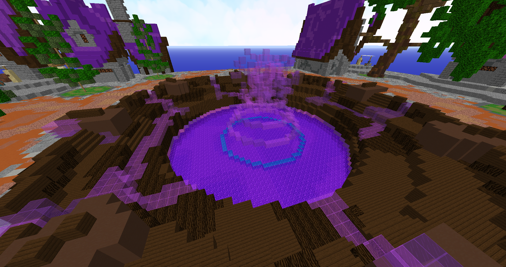
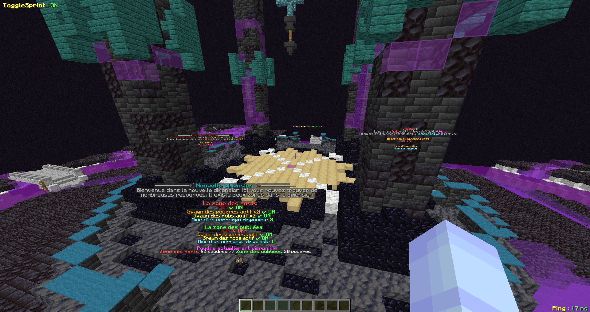
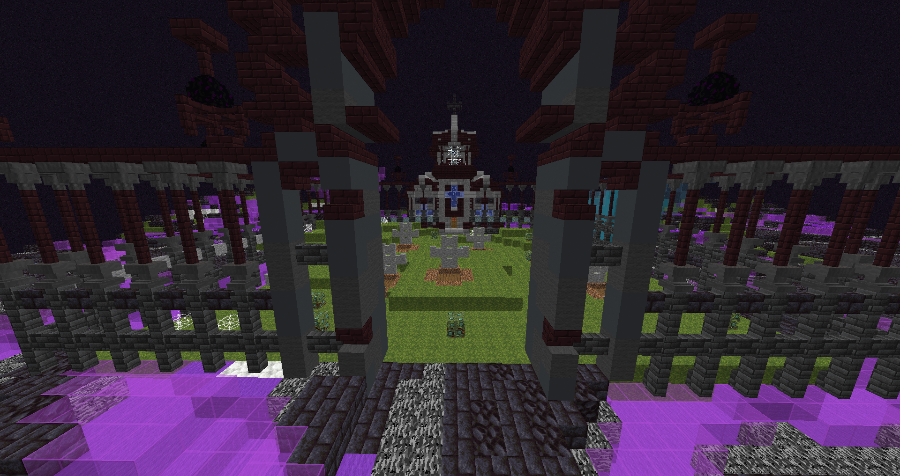
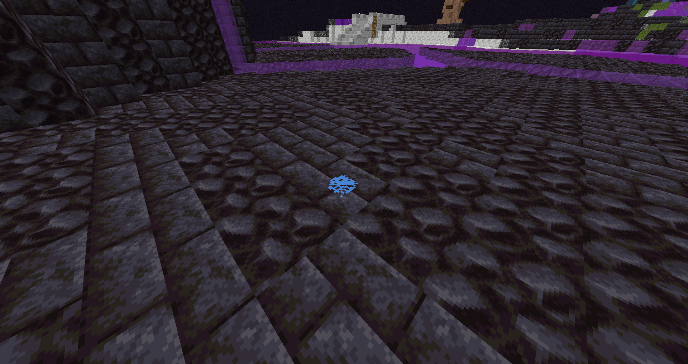
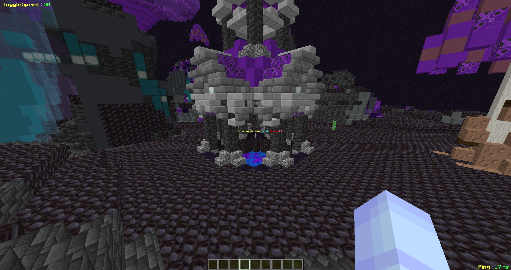

# 🌌 Dimension magique

### L'entrée dans la dimension

Pour débloquer l'accès à la dimension, il faut être <mark style="color:purple;">niveau 10</mark> de magie. \
Une fois le niveau requis atteint, sautez dans le puit magique au spawn.\

<figure><figcaption></figcaption></figure>

<mark style="color:purple;">**Vous voilà dans la dimension magique !**</mark>

<figure><figcaption></figcaption></figure>

### Maintenant deux choix s'offrent a vous, <mark style="color:purple;">deux parties</mark> dans la dimension.&#x20;


Une où le pvp <mark style="color:purple;">est désactivé</mark>, mais où les ressources sont moindres (moins de poudres, moins de mines et moins de cimetières). C'est la première zone, lâ où vous arrivez !



Et une partie où le pvp <mark style="color:purple;">est activé</mark> et ou beaucoup de ressources sont disponibles. Il suffit de trouver l'un des trous dans la première zone pour descendre dans la zone PVP !



Toutes les ressources disponibles dans une zones sont <mark style="color:red;">indiquées</mark> a l'entrée de celle ci.


### Les zones


Dans les deux zones les <mark style="color:orange;">même ressources</mark> sont disponibles mais dans des <mark style="color:red;">quantités différentes</mark>.&#x20;


#### Dans la zone avec le Pvp désactivé, on retrouve <mark style="color:red;">deux mines</mark> d'ors corrompus, <mark style="color:red;">un seul</mark> cimetière pour les buissons de baies moisies, et un max de <mark style="color:red;">20</mark> poudres.&#x20;

#### Pour la zone PVP, <mark style="color:red;">4</mark> mines d'ors corrompus, <mark style="color:red;">4</mark> cimetières et un max de <mark style="color:red;">60</mark> poudres en même temps.

<figure><figcaption></figcaption></figure>

#### Attention en cassant un buisson de baies moisies, il y a une chance que <mark style="color:purple;">des morts vivants spawn</mark> et vous attaquent !&#x20;

<figure><figcaption></figcaption></figure>

#### Quand vous cassez un minerai d'or corrompu, des <mark style="color:purple;">morts vivants spawn</mark> et vous attaquent !

<figure><figcaption></figcaption></figure>

### Deux pnj sont disponibles dans la dimension : [Rodlug](personnage-fictif/rodlug.md) et le [Forgeron de sauron](personnage-fictif/forgeron-de-sauron.md)

#### &#x20;Pour sortir de la dimension, 2 moyens s'offre à vous : - La téléportation, faire simplement un /spawn /tpa /home. - En zone pvp vous pourrez trouver un <mark style="color:orange;">portail</mark>, qui vous <mark style="color:orange;">téléportera</mark> directement en <mark style="color:red;">warzone</mark> !

<figure><figcaption></figcaption></figure>
