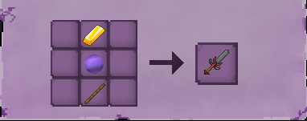

# L'épée Abyssale

### Obtention :&#x20;

* L'épée Abyssale est obtenable via les crafts de la Table de Craft Gémmée.&#x20;

<figure><figcaption>
Craft de l'épée Abyssale
</figcaption></figure>

### Utilité :&#x20;


<mark style="color:purple;">**L'épée Abyssale**</mark> permet de donner un pourcentage de récupérer des <mark style="color:blue;">**œufs de villageois**</mark> qui est de <mark style="color:red;">**3%**</mark> lorsque vous tuez certains monstres, comme les <mark style="color:yellow;">**Gobelins**</mark>, les <mark style="color:yellow;">**Morts-Vivants**</mark>, les <mark style="color:yellow;">**Disciples du Donjon**</mark>.



<mark style="color:purple;">**L'épée Abyssale**</mark> permet aussi de drop des <mark style="color:orange;">**Talismans**</mark> lorsque vous tuez les montres spécifiques à ceux-ci.\

* <mark style="color:red;">**Uniquement l'épée Abyssale permet de drop les Talismans !**</mark>

