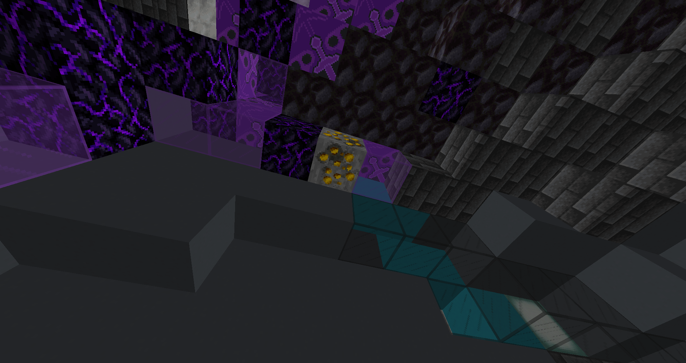

# ⛰ Les mines Corrompues

### Ce sont des zones ou l'on peux trouver des minerais d'or corrompu !

<figure><figcaption></figcaption></figure>


Vous pouvez trouver plusieurs mines, que ce soit en zone <mark style="color:red;">non PVP</mark> et en zone <mark style="color:red;">PVP</mark> ! (2 en non PVP, 4 en PVP)



Vous pourrez trouver ce minerais dans <mark style="color:orange;">les mines,</mark> il vous donnera un d'or corrompu !&#x20;



<mark style="color:red;">ATTENTION !</mark> Quand vous allez <mark style="color:orange;">miner</mark> le minerai, des <mark style="color:red;">morts-vivants</mark> vont spawn !

