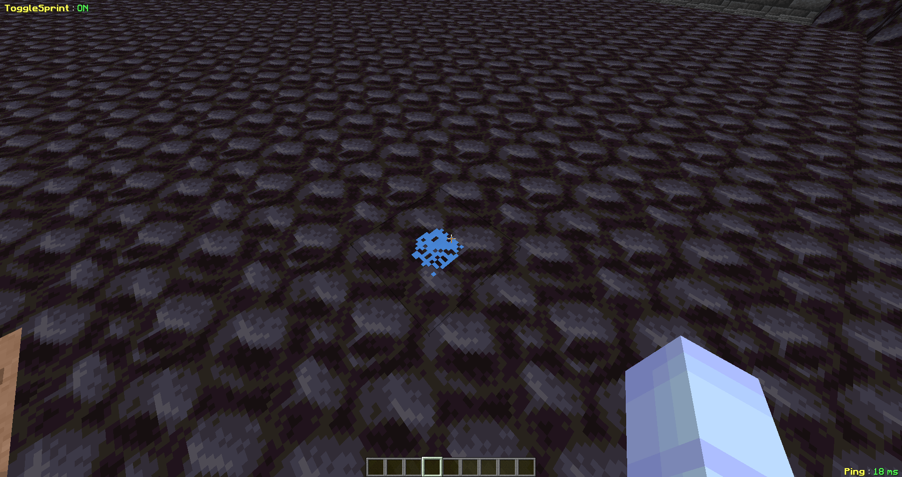

# 💨 Les poudres

### Les poudres peuvent être trouvées un peu <mark style="color:red;">partout</mark> dans la dimension !

<figure><figcaption></figcaption></figure>


Il y a 6 poudres de couleurs <mark style="color:red;">différentes</mark> ! Chaque poudre est <mark style="color:orange;">associée</mark> à une [bague](../les-bagues.md). Pour récupérer les poudres, il suffit de la <mark style="color:red;">casser</mark> !



Il y a <mark style="color:orange;">plus de poudre</mark> en zone PVP (<mark style="color:red;">60 max</mark>) contrairement à la zone <mark style="color:orange;">non PVP</mark> ou le nombre max de poudre est de <mark style="color:red;">20</mark> !

