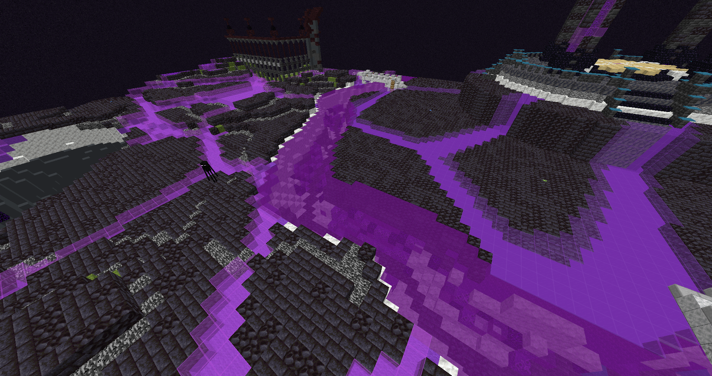
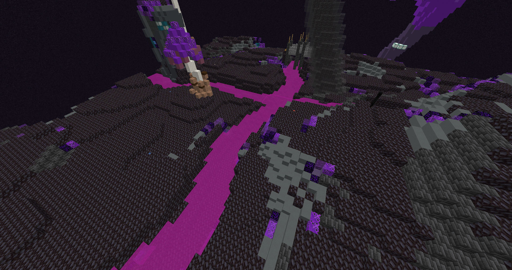

# 🐠 Pêche magique


### La pêche magique se situe dans la dimension magique



Dans la dimension magique, vous y trouverez <mark style="color:orange;">des rivières de pêche magique</mark> que vous soyez dans <mark style="color:red;">la zone des morts</mark> _(pvp activé)_  ou <mark style="color:red;">la zone des oubliés</mark> _(pvp désactivé_)


<figure><figcaption>
<mark style="color:red;">la zone des oubliés</mark>
</figcaption></figure>

<figure><figcaption>
<mark style="color:red;">la zone des morts</mark>
</figcaption></figure>


Dans la zone des oubliés, vous pouvez <mark style="color:orange;">pêcher</mark> jusqu'à des loots <mark style="color:red;">épiques</mark> !



Dans la zone des morts, vous pouvez <mark style="color:orange;">pêcher</mark> jusqu'à des loots <mark style="color:red;">légendaire</mark> !



<mark style="color:red;">ATTENTION !</mark> Si vous pêchez un item dans la zone des morts, des morts vivants vont spawn !


### Pour avoir tous les loots disponible ---> <mark style="color:red;">/peche</mark> !
