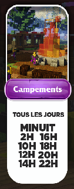

# 🏕 Campements

C'est un événement PVP connu depuis la nuit des temps sur Nexion, il a été le premier celui qui a directement plu aux guerriers aguerries.


**Période de l'événement :** TOUS LES JOURS. Toutes les 2 HEURES


 

Quand le campement se lance, des guerriers apparaissent dans l'un des 4 campements en Warzone. Tuer tous les guerriers pour le chef spawn ! \
À la moitié de sa vie le chef du campement fait spawn des healers ! Pour gagner le campement le but est simple, infliger le plus de dégâts au chef pour remporter l'événement


Attention aux archers, pouvant tirer des flèches


Une fois l'événement terminé des objets apparaissent dans les coffres aux alentours du camp.
