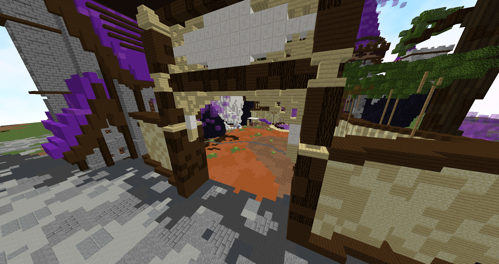

# ⛺ Camps des gobelins

## Les camps gobelins&#x20;


<mark style="color:orange;">Deux types</mark> de camps gobelins éxistent sur nexion ! Un camp en <mark style="color:red;">Warzone</mark> et deux camps dans Holbeck !


### Le camp gobelins en Warzone


Dans ce camp gobelins, du <mark style="color:orange;">tabac</mark> est disponible. Il est récupérable <mark style="color:red;">uniquement</mark> avec le GANT de jardinage !


<figure><figcaption></figcaption></figure>


Le tabac est utilisé pour <mark style="color:orange;">trade</mark> avec le Chef du camp de gobelins contre des <mark style="color:red;">pièce d'or</mark> !


<figure><figcaption></figcaption></figure>


<mark style="color:red;">ATTENTION !</mark> Les gobelins sont toujours agréssifs ! Si le chef est attaqué, il s'énerve pour 15 minutes.&#x20;


### Les camps gobelins dans Holbeck&#x20;


Dans ces camps gobelins, de <mark style="color:orange;">la menthe</mark> est disponible. Il est récupérable <mark style="color:red;">uniquement</mark> avec le GANT de jardinage !



Le tabac est utilisé pour <mark style="color:orange;">trade</mark> avec le Chef du camp contre des <mark style="color:red;">pièce d'argent</mark> !

