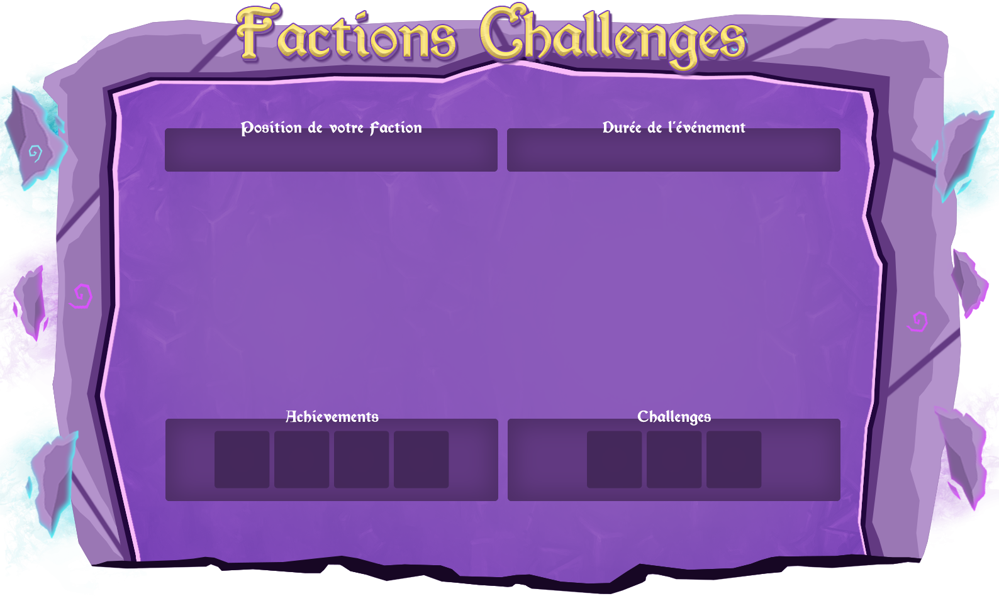

# 📊 Faction Challenge

### Le Faction Challenge est un évent qui se déroule le durant tout le <mark style="color:orange;">week-end</mark>, commençant le <mark style="color:red;">Samedi à 10h</mark> jusqu'à <mark style="color:red;">Dimanche 23h59</mark>


Cet évent fonctionne sous forme de **classement**. Ainsi à la fin du temps imparti, les factions se verront attribuer des **Partisans** en fonction de leur place dans le classement.


* Durant cet évent vous avez plusieurs possibilités de monter dans le classement. Premièrement, le Farming, vous aurez plusieurs **Achievements** à effectuer afin de gagner des points.
* Deuxièmement, tout comme les achievements, vous aurez plusieurs **Challenges** à accomplir et vous donneront des points en échange de leurs accomplissement.
* Troisièmement, vous disposerez aussi de mini "**Koth**" en Warzone les coordonnées seront donné à vous d'aller capturer la zone donnée.
* Pour finir l'évènement [**Game Of Thrones**](game-of-thrones.md), se déroulant Dimanche en fin de journée, celui-ci annonce la dernière ligne droite du **Faction Challenge**. Le Game Of Thrones peut apporter une avance colossale à la faction gagnante !&#x20;

<figure><figcaption>
Interface du Faction Challenge
</figcaption></figure>
