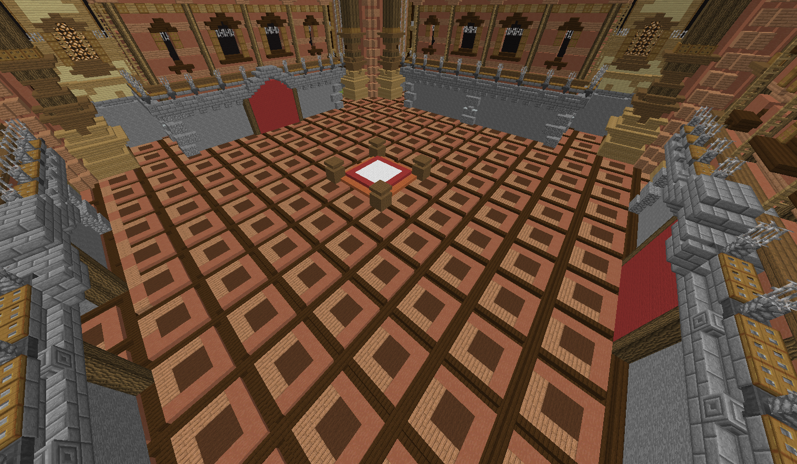

# ⌛ Game Of Thrones

### L'évènement Game of Thrones se déroule dans le <mark style="color:orange;">monde du donjon</mark> _(/got)_, il se déroule tous les dimanches à <mark style="color:red;">17h</mark> !

#### Le donjon se passe en <mark style="color:orange;">deux étapes</mark>, <mark style="color:red;">la qualification</mark> puis le <mark style="color:red;">KOTH</mark> !


### La qualification :

\
Pour cette première partie, il faudra <mark style="color:orange;">casser</mark> un cristal pour <mark style="color:red;">qualifier</mark> sa faction !


<mark style="color:red;">**ATTENTION !**</mark>  Il faut mettre le <mark style="color:orange;">dernier</mark> coup sur un cristal pour <mark style="color:red;">qualifier</mark> sa faction !&#x20;

Il y a <mark style="color:orange;">10 cristaux</mark>, donc un potentiel de <mark style="color:red;">10 factions</mark> qualifiées ! Après qu'une faction ait cassé un cristal, elle ne peut plus en casser d'autre. Vous obtiendrez <mark style="color:red;">20</mark> points de faction challenge.


### Le KOTH (King of the Hill) :

\
Bravo ! Votre faction est qualifiée, vous avez <mark style="color:orange;">1 min 30</mark> pour rentrer dans le palais, après cela, tout entrée sera <mark style="color:red;">impossible</mark> !&#x20;


<figure><figcaption>
Entrée du Palais
</figcaption></figure>


<mark style="color:red;">**ATTENTION !**</mark>  Seulement <mark style="color:orange;">5</mark> personnes par faction peuvent rentrer dans le palais, choisissez bien vos <mark style="color:red;">combattants</mark> ! Dans le palais, il est <mark style="color:red;">impossible</mark> de se punch !


<figure><figcaption>
L'intérieur du Palais
</figcaption></figure>


Une fois rentré dans le palais, vous n'avez qu'une seule <mark style="color:orange;">mission</mark>, <mark style="color:red;">tenir</mark> <mark style="color:red;">2 minutes</mark> dans le petit carré central ! \
\
<mark style="color:orange;">Entrer</mark> dans la zone déclenche le compteur, dès que vous en <mark style="color:orange;">sortez</mark>, il est remis à <mark style="color:red;">0</mark>\
\
La personne qui restera <mark style="color:orange;">2 minutes</mark> au milieu fait <mark style="color:red;">gagner</mark> sa faction !&#x20;



Vous pouvez à <mark style="color:orange;">tout moment</mark> sortir du palais, mais <mark style="color:red;">attention</mark> cette sortie est définitive !



<mark style="color:red;">**LES ALLIANCES SONT STRICTEMENT INTERDITES !**</mark>


#### Le portail situé à <mark style="color:orange;">l'entrée du monde donjon</mark> ramenant à la warzone est <mark style="color:red;">desactivé</mark> pendant toute la durée de l'évènement.


La faction qui remporte le GOT obtient 100 points pour le faction challenge. En plus de cela, toute la faction obtient les effets <mark style="color:blue;">**Speed II**</mark> / <mark style="color:red;">**Fire Resistance**</mark> / <mark style="color:green;">**3 cœurs**</mark> supplémentaires en dimension jusqu'au prochain GOT !

