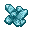
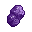
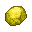
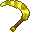
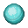

# ⛏ Minerais

Dans l'univers de Nexion, les ressources les plus précieuses pourront se trouver sous tes pieds. En creusant de la **couche 0 à 16** tu pourras trouver plusieurs minerais qui pourront t'être très utiles pour la suite de ton aventure. Certains peuvent se trouver dans le monde de paix et d'autres dans des dimensions de guerre. Gloire et fortune à toi, mais prends garde, ne soit pas trop avare de richesse.


<mark style="color:blue;">**ASTUCE / INFORMATIONS**</mark>\
Tu dois miner de la pierre pour trouver des minerais vu qu'il n'y a pas de grottes, ni de mines artificielles. La meilleure technique est de miner tout droit dans la roche, jusqu'à temps de trouver le minerai que tu souhaites.&#x20;


Avant tout il faut savoir que nous avons tout de même les minerais principaux de Minecraft. Tu le sais déjà le meilleur minerais sur Minecraft est le diamant. MAIS sur Nexion, tout les minerais sont plus fort que le diamant, autrement dit le premier nouveau minerai [L'opale](minerais.md#opale) est tout de même plus fort que le diamant.

## Les minerais

### <mark style="color:blue;">**Opale**</mark>&#x20;

L'opale est un minerai commun, il permet de fabriquer l'armure et les outils les moins puissants et aussi les moins résistants de Nexion. Il permet également de fabriquer divers objets. Minerai duplicable avec la pioche de richesse.\
**Exemple d'objet à fabriquer :**.png>).png>).png>).png>).png>).png>).png>).png>)

### <mark style="color:purple;">**Iris**</mark>&#x20;

L'iris est un minerai rare, il permet de fabriquer l'armure et les outils plus puissant et résistant que ceux en opale. Il permet également de fabriquer divers objets. Minerai duplicable avec la pioche de richesse.\
**Exemple d'objet à fabriquer :** .png>).png>).png>).png>).png>).png>)

### .png>)<mark style="color:yellow;">**Titane**</mark>

Le titane est le minerai le plus rare, il permet de fabriquer l'armure et les outils plus puissant et résistant que ceux en iris. Il permet également de fabriquer divers objets. Minerai duplicable avec la pioche de richesse.\
**Exemple d'objet à fabriquer :** .png>).png>).png>).png>)

### **Minerai d’**<mark style="color:green;">**Expérience**</mark>&#x20;

Le minerai d'expérience permet d’avoir de l’expérience Minecraft lorsque tu le mines.&#x20;

 (1).png>)

### **Minerai de **<mark style="color:blue;">**Mana**</mark>

Le mana issu du minerai de mana est un minerai plus ou moins rare. Il permet de réaliser des échanges avec les PNJ magiques.

### ​**Minerai aléatoire**

Le minerai aléatoire est rare, il permet avec un pourcentage de chance d’avoir un des trois minerais, ou alors des fragments de gemmes en le minant. Drops duplicables avec la pioche de richesse.

Minerais obtenables :\
Fragments de Gemmes obtenables : 

### Minerai aléatoire de Gemme

Le minerai aléatoire de gemme est issu de la transformation magique réussie du minerai aléatoire. Il permet d'obtenir un fragment de gemme aléatoire en le minant OU plus exceptionnellement une gemme aléatoire directement. Les drops peuvent être dupliqués ( faible pourcentage ) avec une pioche de richesse Gemmée.

Fragments de Gemmes obtenables : \
Gemmes obtenables **:** 
