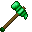

# ⛏ Pioches




_**Ce sont les pioches**_ _**fabricables via la table de fabrication classique.**_



### .png>)  Pioche en <mark style="color:blue;">Opale</mark> .png>)

**Durabilité** : 3 200



### .png>)  Pioche en <mark style="color:purple;">Iris</mark> .png>)

**Durabilité** : 4 500



### .png>)  Pioche en <mark style="color:yellow;">Titane</mark> 

**Durabilité** : 7 500



### .png>)  Pioche de <mark style="background-color:orange;">Richesse</mark> 

**Durabilité** : 99\

### Cette pioche permet de <mark style="color:orange;">doubler</mark> le minerai miné, cela fonctionne avec <mark style="color:red;">tous les minerais</mark>

Sauf le minerai aléatoire de gemmes _(Ne peut pas être enchanté solidité)_



### .png>)  Masse 

**Durabilité** : 1 200\

### Vous permet de miner une zone de <mark style="color:red;">3x3x1</mark>





_**Ce sont les pioches fabricables uniquement via la table de fabrication gemmée**._



### .png>)  Pioche de <mark style="background-color:orange;">Richesse Gemmée</mark> 

**Durabilité** : 99\

### Vous avez <mark style="color:orange;">10%</mark> de chance de <mark style="color:red;">dupliquer</mark> vos loots quand vous cassez des <mark style="background-color:red;">Minerais aléatoires de Gemmes</mark> !

_(Ne peut pas être enchanté solidité)_



### .png>)  Pioche à <mark style="background-color:purple;">Obsidienne</mark> 

**Durabilité** : 1 750\

### Cette pioche vous permet de <mark style="color:orange;">casser</mark> l'obsidienne <mark style="color:red;">rapidement</mark> !&#x20;

_"Clic droit"_ pour enlever l'obsidienne. _(Cette pioche n'est pas réparable)_





_**C'est ici que tu retrouves la pioche légendaire du serveur obtenable de différentes façons expliqués ci-dessous.**_



### &#x20;    Pioche de <mark style="background-color:red;">Drahe</mark> 

**Durabilité** : 5 000\

### Cette pioche vous permet de <mark style="color:orange;">miner</mark> une zone de <mark style="color:red;">3x3x3</mark> !

Pour obtenir cette pioche, il vous faudra faire un échange avec Guldor contre des pièces d'or !



