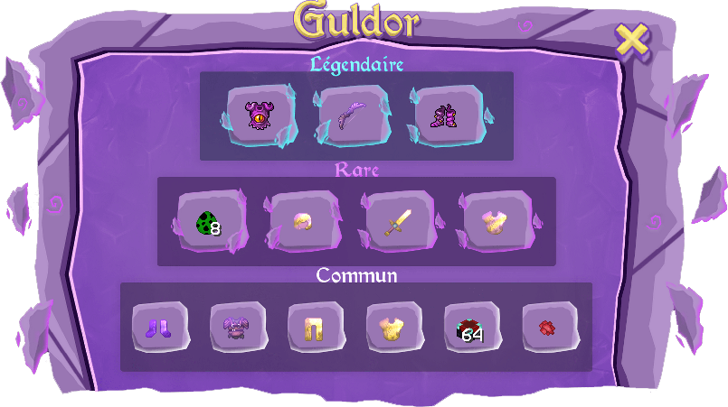

# 🧙♂ Guldor

**Guldor est un marchand légendaire sur Nexion.** Il a gagné de nombreuses batailles et vaincu des guerriers légendaires, aujourd'hui, il t'offre les objets qu'il a pu récupérer lors de ces combats. Il te permet d’effectuer divers échanges contre des pièces d'or.


Il apparait au **SPAWN** le **MERCREDI** et te propose uniquement des objets **COMMUN**.\
Il apparait aléatoirement dans la **WARZONE** le **SAMEDI & DIMANCHE** et te propose tout.&#x20;


<figure><figcaption></figcaption></figure>

* **Légendaire : 3 objets** (2 achat disponible)
* **Rare : 4 objets**  (10 achats disponible)
* **Commun : 6 objets** (20 achats disponible)


<mark style="color:red;">**ATTENTION !**</mark> Le nombre d'objets est limité, premier arrivé = premier servi.\




<mark style="color:blue;">**ASTUCE :**</mark>\
À l'aide de la commande **`/guldor`** tu peux savoir dans combien de temps exactement il fera son apparition ainsi que le lieu. (Tu ne pourras pas avoir le lieu précis en Warzone)


