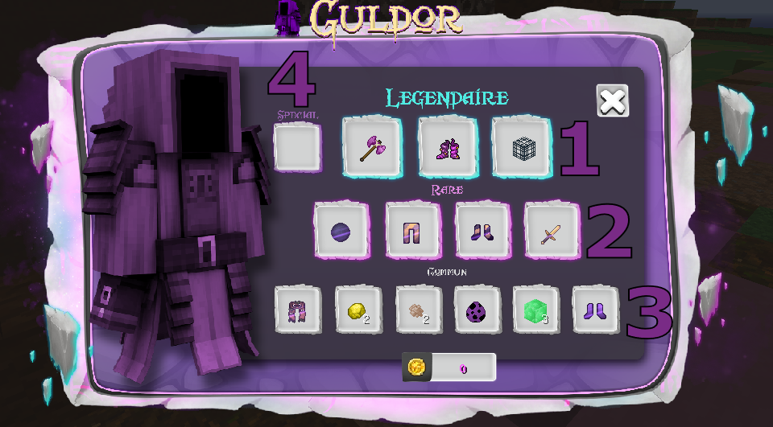

# 🧙♂ Guldor

Le marchand Guldor est l'un des deux marchés noirs, le deuxième n'est autre que son frère maléfique[rodlug.md](rodlug.md "mention") !


<mark style="color:blue;">**INFORMATIONS :**</mark>  \
Il apparait a différents endroits en warzone mais aussi au spawn


Il te permet d’effectuer divers échanges contre des pièces d'or.&#x20;


<mark style="color:red;">**ATTENTION !**</mark> Le nombre d'objets est limité, premier arrivé premier servi.


Il existe 4 catégories différentes :

* 1\. <mark style="color:blue;">Légendaire</mark>
* 2\. <mark style="color:green;">Rare</mark>
* 3\. Commun
* 4\. <mark style="color:purple;">Spéciale</mark>


<mark style="color:blue;">**INFORMATIONS :**</mark> \
La catégorie "spéciale" te donne accès un objet privé, personne d'autre ne peut acheter a par toi ! Tu as donc tous ton temps pour venir le récupérer ! Elle se débloque avec la  compétence ''boost guldor'' de la [classe-marchande.md](../../systeme-a-connaitre/specialites/classe-marchande.md "mention")&#x20;



_<mark style="color:orange;">**Remarque :**</mark>_ \
Les catégories ''<mark style="color:blue;">légendaire</mark>'' et ''<mark style="color:purple;">spéciale''</mark> sont les deux seuls moyens d'obtenir l'amure légendaire de menos **(** [Broken link](broken-reference "mention") **)**



<mark style="color:blue;">**ASTUCE :**</mark>\
À l'aide de la commande ''/guldor'', tu peux savoir dans combien de temps exactement il fera son apparition ainsi que le lieu  !

