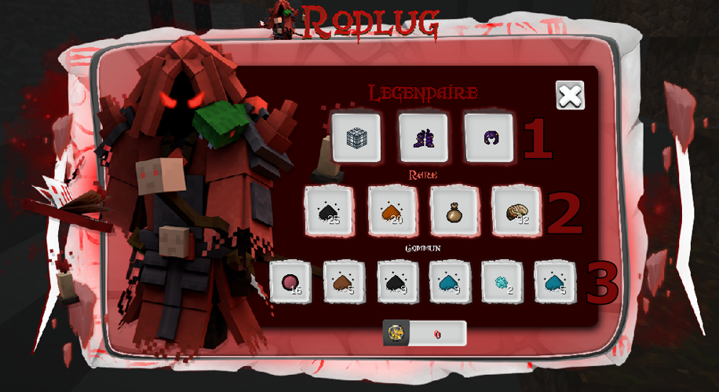

# Rodlug

&#x20;Le marchand Rodlug est le frère maléfique de [guldor.md](guldor.md "mention"), Il apparait a différents endroits dans [la-nouvelle-dimension.md](../la-nouvelle-dimension.md "mention") magique le week-end. \

Il te permet d’effectuer divers échanges contre des pièces d'or corrompues.


<mark style="color:red;">**ATTENTION !**</mark> Le nombre d'objets est limité, premier arrivé premier servi !


Il existe 3 catégories différentes :

* 1\. <mark style="color:red;">Légendaire</mark>&#x20;
* 2\. <mark style="color:orange;">Rare</mark>
* 3\. Commun


_<mark style="color:orange;">**Remarque :**</mark>_ \
La catégorie <mark style="color:red;">légendaire</mark> est le seul moyen d'obtenir l'amure légendaire de vascur                                                                                            **(**[#les-armures-legendaires](../minerais-et-armures.md#les-armures-legendaires "mention")**)**, ainsi que l'arc de vascur.



<mark style="color:blue;">**ASTUCE :**</mark>\ <mark style="color:blue;">****</mark>À l'aide de la commande ‘’/Rodlug’’, tu peux savoir dans combien de temps exactement il fera son apparition !


