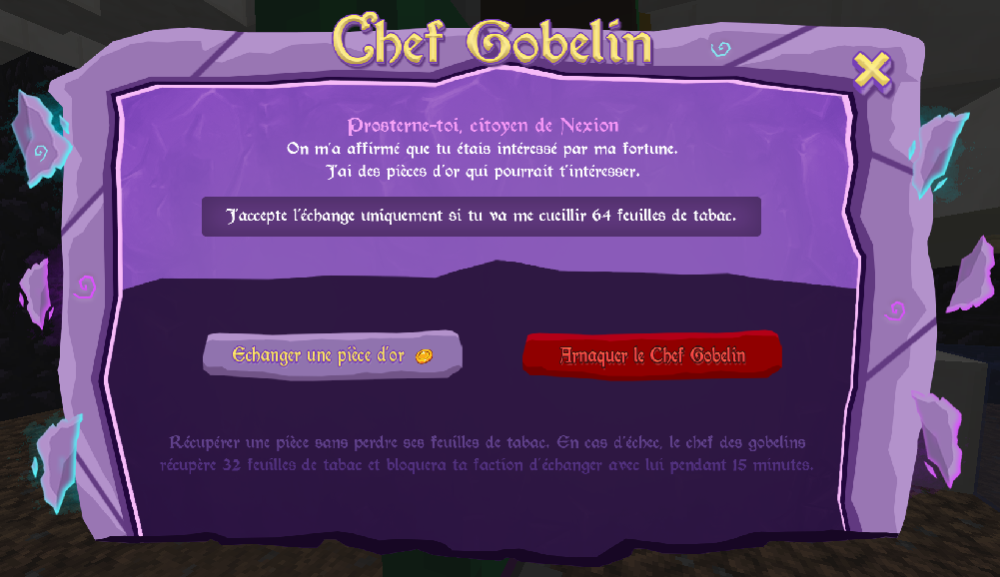
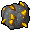
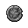

# 🪙 Pièces d'or / or corrompu / argent

**Plusieurs façons d'obtenir des pièce d'or** **:**

\- Gagnez un évent, la pièce d'or est un loot rare à la fin de certains évents.

\- Trade avec le Chef des gobelins (Warzone), 64 tabacs  contre 1 pièce d'or, vous pouvez tenter de l'arnaquer, mais c'est à vos risques et périls !

<figure><figcaption>
Menu d'échange chef gobelin (Warzone)
</figcaption></figure>

\- Les enchères légendaires peuvent contenir des pièces d'or.

\- Les pièces d'or sont aussi disponibles à un certain niveau dans le shop des quêtes.

**Pour les pièces d'or corrompu** **,** c'est simple, une pièce d'or  avec un or corrompue  dans une table de craft, et voici votre pièce d'or corrompue !

**Les pièces d'argent**  sont la nouvelle monnaie d'échange de la cité de holbeck, on peut en obtenir en faisant les quêtes du roi tous les jours !\
On peut aussi en obtenir avec le Chef des gobelins (Holbeck), pour 64 menthes .\

<figure><figcaption>
Menu d'échange chef gobelin (Holbeck)
</figcaption></figure>

**Utilisation des pièces :**

Les pièces d'or / d'or corrompu, servent a acheter des items auprès de Rodlug et Guldor\
Les pièces d'argent servent à acheter des items auprès de Vaarel\

Pour obtenir l'armure légendaire de Menos, vous devez marchander contre des pièces d'or à Guldor celui-ci vous offrira de quoi vous équiper de cette nouvelle armure.

\
Pour obtenir l'armure légendaire de Vascur, vous devez marchander contre des pièces d'or corrompue à Rodlug celui-ci vous offrira de quoi vous équiper de cette nouvelle armure.

Pour obtenir l'armure légendaire de Maxar, vous devez marchander contre des pièces d'argent à Varrel celui-ci vous offrira de quoi vous équiper de cette nouvelle armure.

\

