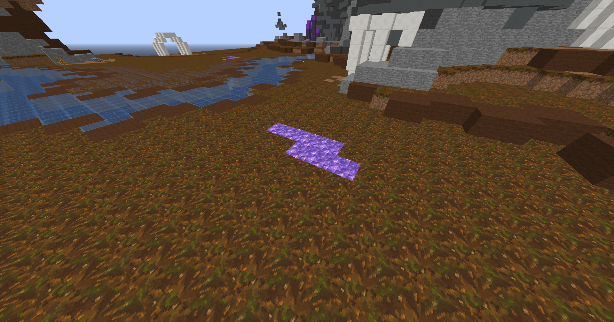

# 🔰 Iris arena

#### _Tu en as marre de te faire atomiser par des stuffs légendaires alors que tu peines déjà à te faire un P4 iris ?_

### L'IRIS ARENA EST FAITE POUR TOI !


_Attention si tu déconnectes dans l'arène, <mark style="color:red;">t</mark><mark style="color:red;">**u succomberas immédiatement !**</mark>_


<figure><figcaption>
<strong>IRIS ARENA</strong>
</figcaption></figure>


#### _L'intégralité des items légendaires ainsi que les items en titane y sont <mark style="color:red;">interdits</mark>._


_Tu pourras donc y combattre à stuff équitable et augmenter tes chances de multiplier tes richesses._&#x20;

_Cependant, l'arène a été infesté par une horde de sorcières et de guerriers._\
_Mais pas de panique, cela te permettra aussi d'y obtenir divers loots._

|           Sorcière          |      Guerrier     |
| :-------------------------: | :---------------: |
|      _Poudre de blaze_      |  _Perle du néant_ |
|       _Larme de ghast_      | _Potion amélioré_ |
|       _Crème de magma_      |                   |
|   _Pastèque scintillante_   |                   |
|      _Oeil d'araignée_      |                   |
| _Poudre de pierre luisante_ |                   |
|       _Poudre à canon_      |                   |
|           _Sucre_           |                   |
|          _Redstone_         |                   |
|         _Fiole vide_        |                   |

## _Comment la rejoindre ?_


_Rien de plus simple, il te suffit simplement de te rendre à gauche du point de spawn et de cliquer sur <mark style="background-color:purple;">Spartacus</mark>_


<figure><figcaption>
<strong>SPARTACUS</strong>
</figcaption></figure>

## _Rentrer c'est bien mais sortir c'est parfois mieux !_

_Trouve une des nombreuses zones en améthyste et tu pourras fuir cette zone hostile._&#x20;


_Durée de téléportation de <mark style="color:red;">5 secondes</mark>._


<figure><figcaption>
<strong>ZONE DE RETOUR SPAWN</strong>
</figcaption></figure>
