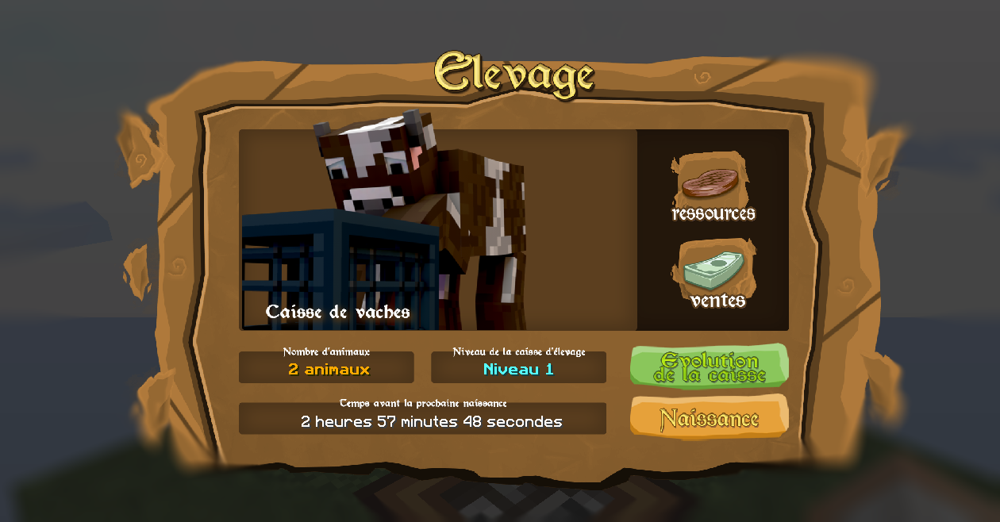

# 🐷 Elevage

<figure><figcaption>
Interface d'élevage
</figcaption></figure>

## **Caisses d'élevages**

Pour lancer un élevage, vous devez donner 2 œufs du même type que la caisse d'élevage

* Vaches :cow2:
* Moutons :sheep:
* Cochons :pig:
* Poulets :chicken:


\
**Obtention :** Dans la cité d'Holbeck, il y a 2 fermes avec 2 fermiers. En faisant des échanges avec eux vous pouvez obtenir les caisses d'élevages ou des ressources liées aux caisses.\
\
**Utilité :** Récolter des ressources ou soit de vendre des animaux.\
\
**Placement :** Entoure la cage de 8 bloc d'herbe pour interagir avec.\



### Comment avoir plus d'animaux dans vos cages ?

* Lors d'une **naissance**, vous pouvez avoir entre **1 à 3 animaux** qui apparaissent.
* Vous avez **une heure** pour les nourrir sinon ils meurent.
* Lorsqu'ils sont nourri, ils vont dans la caisse d'élevage. <mark style="color:green;">**(+1 animal)**</mark>

### Les niveaux de caisses d'élevage

Il existe 3 Niveaux de Caisses d'élevage (Par défaut la caisse est niveau 1) :

* Avantage Niveau 1 : cooldown de 3 heures avant de pouvoir faire une nouvelle naissance, le cout de la vente d'un animal est de 200$. Nombre d'animaux maximum : 100. Nombre de ressources accumulable maximum : 1000. Temps avant le drop d'une nouvelle ressource : toutes les 1 heure.
* Avantage Niveau 2 : cooldown de 2 heures avant de pouvoir faire une nouvelle naissance, le cout de la vente d'un animal est de 400$. Nombre d'animaux maximum : 200. Nombre de ressources accumulable maximum : 2000. Temps avant le drop d'une nouvelle ressource : toutes les 45 minutes.
* Avantage Niveau 3 : cooldown de 1 heure avant de pouvoir faire une nouvelle naissance, le cout de la vente d'un animal est de 600$. Nombre d'animaux maximum : 300. Nombre de ressources accumulable maximum : 3000. Temps avant le drop d'une nouvelle ressource : toutes les 30 minutes.\
  \

* Pour faire évoluer une caisse d'élevage, vous devez donner un certains nombres d'animaux :
  * Niveau 1 ➝ Niveau 2 = 30 Animaux
  * Niveau 2 ➝ Niveau 3 = 60 Animaux\
    \

* Vous pouvez poser par défaut 10 Caisses d'élevages dans votre faction. (Vous êtes obligés de les poser dans vos claims)\
  \

* Si vous cassez une caisse d'élevage ou que la zone est unclaim, toutes les ressources et animaux disparaissent (Comme les maisons de villageois). Par contre vous gardez le niveau de la caisse d'élevage.\
  \

* 1 Animal = 1 ressource qui drop tous les x temps. Exemple si vous avez 85 animaux dans une caisse d'élevage de niveau 2, vous allez drop 85 ressources toutes les 45 minutes.
