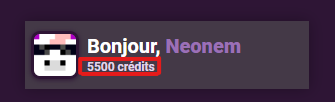
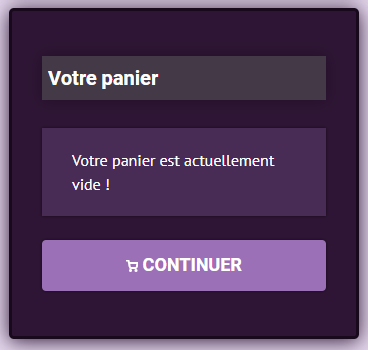

# 🛒 Boutique sur le site

Envie de vous faire plaisir ?&#x20;

## A quoi sert la boutique ?

En achetant du contenu exclusifs sur la boutique de <mark style="color:purple;">**Nexion**</mark> vous soutenez le projet et pouvez profiter d'avantages directement sur le factions. Que cela soit cosmétique, grades, kits, spawners.

## Comment créditer son compte pour acheter sur la boutique ?

Pour tout achat sur la boutique, il vous faut posséder des **crédits** aussi appelé **point-boutiques**

Pour créditer votre compte est avoir des **crédits** vous pouvez cliquer sur le bouton en dessous pour <mark style="color:purple;">**\[ACHETER DES CRÉDITS]**</mark>

Le prix de chaque article est inscrit en haut à droite de l'article souhaiter.

En cliquant sur un article de la boutique, vous ajoutez celui-ci directement à votre panier.

1. Lorsque vous avez fini de mettre des articles dans votre panier.&#x20;
2. Vous pouvez passer directement à l'achat de votre panier pour payer avec vos **crédits (points-boutique).**
3. Pour tout achat, il vous faut **impérativement** être connecté en jeu.

