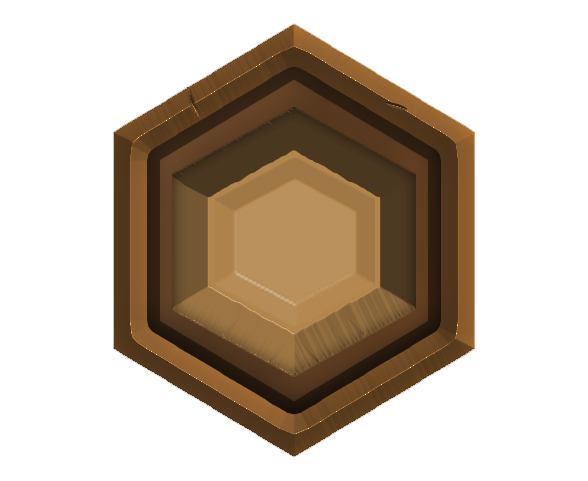
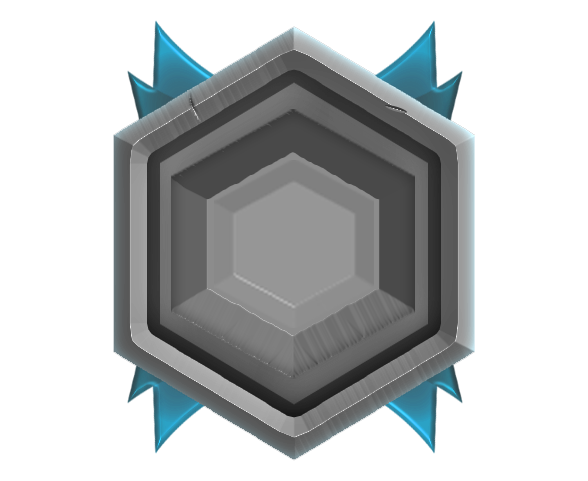
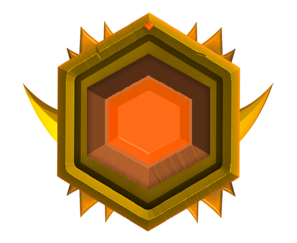
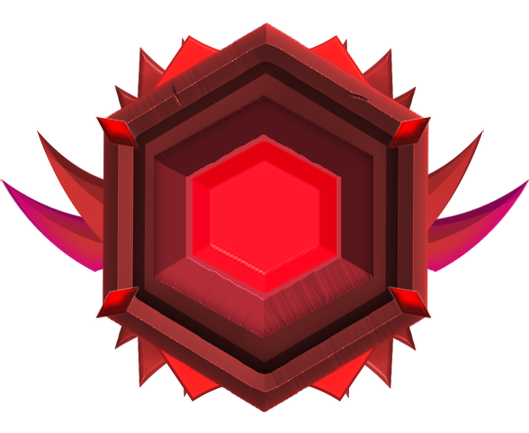
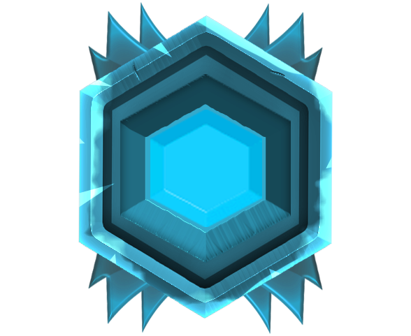

# ⚔ Factions

## Qu'est ce que le faction ?

Le plugin Faction est un ajout populaire qui permet aux joueurs de créer des clans ou des factions pour collaborer, se défendre mutuellement et conquérir des territoires sur le serveur. Voici quelques-unes des principales fonctionnalités de ce plugin.

* **Création de Factions** : Les joueurs peuvent créer leurs propres factions en jeu. Cela leur permet de s'allier avec d'autres joueurs et de partager des ressources, des bases et des territoires. `(/f create Faction)`
* **Territoires** : Chaque faction peut revendiquer un territoire sur la carte du serveur. Les territoires sont souvent délimités par des frontières invisibles, et seuls les membres de la faction peuvent construire et interagir dans leur propre territoire. `(/f claim)`
* **Gestion des Membres** : Les chefs de faction peuvent gérer les membres de leur faction, en les invitant, les promouvant, les excluant, ou en leur attribuant des rôles spécifiques avec des autorisations personnalisées.
* **Guerres de Factions** : Les factions peuvent se déclarer la guerre les unes aux autres. Cela peut déclencher des combats en PvP (joueur contre joueur) dans les territoires en litige.
* **Alliances** : Les factions peuvent également former des alliances pour travailler ensemble dans des objectifs communs, comme la défense contre des factions ennemies.
* **Extensions de Territoire** : Les factions peuvent conquérir de nouveaux territoires en élargissant leur influence et en gagnant des points de pouvoir grâce à diverses activités.

Une dimension sociale et stratégique au jeu, en encourageant la collaboration, la compétition et les interactions entre les joueurs. Il est utilisé par notre communauté pour créer des dynamiques et des conflits palpitants.

## Les rangs


6 rangs sont disponible sur nexion :&#x20;

* Bronze  
* Silver  
* Gold  
* Platinum  
* Diamant  
* Master  



Pour <mark style="color:orange;">augmenter</mark> le rang de votre faction, il vous faudra des <mark style="color:red;">partisans</mark> et de <mark style="color:red;">l'argent</mark> !&#x20;


## Les menus


Pour avoir accès au menu de votre faction, <mark style="color:red;">**/f menu**</mark> c'est ici que vous pourrez gérer les <mark style="color:red;">permissions</mark> de votre faction / des joueurs !


## Les compétences


Pour <mark style="color:orange;">débloquer</mark> une compétence, vous devez avoir le <mark style="color:red;">rang</mark> et <mark style="color:red;">l'argent</mark> requis ! Chaque <mark style="color:orange;">compétence</mark> possède un ou plusieurs niveaux <mark style="color:red;">déblocables</mark> avec un certain rang !


<figure><figcaption></figcaption></figure>

## Les achivements&#x20;


Pour chaque faction, des achivements <mark style="color:orange;">sont disponibles</mark> ! Ils vous feront <mark style="color:red;">gagner des partisans</mark> ! _(Ils seront reset chaque mois avec le classement !)_&#x20;


<figure><figcaption></figcaption></figure>
