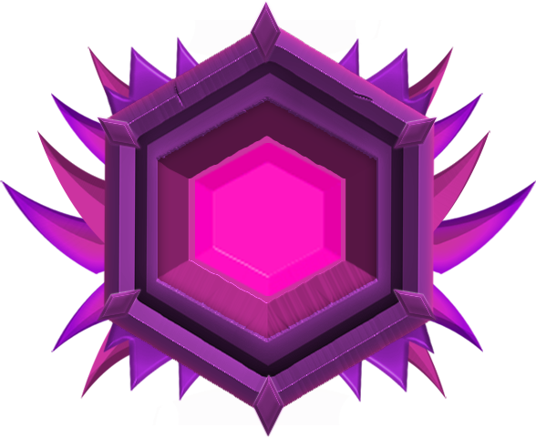

# ⚔ Factions


Le plugin Factions permet aux joueurs de <mark style="color:orange;">se regrouper</mark> au sein d'<mark style="color:red;">une faction</mark> commune et d'un canal de discussion privé. \
Les factions peuvent <mark style="color:orange;">revendiquer</mark> des terres, établir leurs propres relations diplomatiques, mettre de leurs ressources en commun dans les coffres de faction et construire une base protégée.



Les chefs de faction <mark style="color:orange;">contrôlent qui</mark> peut modifier leur terrain, ouvrir des coffres, utiliser des portes et bien plus encore ! En établissant des relations <mark style="color:red;">uniques</mark> à votre faction, vous pouvez déclarer la guerre pour construire l'héritage de votre faction !


## Les rangs


6 rangs sont disponible sur nexion :&#x20;

* Bronze  
* Silver  
* Gold  
* Platinum  
* Diamant  
* Master  



Pour <mark style="color:orange;">augmenter</mark> le rang de votre faction, il vous faudra des <mark style="color:red;">partisans</mark> et de <mark style="color:red;">l'argent</mark> !&#x20;


## Les menus


Pour avoir accès au menu de votre faction, <mark style="color:red;">**/f menu**</mark> c'est ici que vous pourrez gérer les <mark style="color:red;">permissions</mark> de votre faction / des joueurs !


## Les compétences


Pour <mark style="color:orange;">débloquer</mark> une compétence, vous devez avoir le <mark style="color:red;">rang</mark> et <mark style="color:red;">l'argent</mark> requis ! Chaque <mark style="color:orange;">compétence</mark> possède un ou plusieurs niveaux <mark style="color:red;">déblocables</mark> avec un certain rang !


<figure><figcaption></figcaption></figure>

## Les achivements&#x20;


Pour chaque faction, des achivements <mark style="color:orange;">sont disponibles</mark> ! Ils vous feront <mark style="color:red;">gagner des partisans</mark> ! _(Ils seront reset chaque mois avec le classement !)_&#x20;


<figure><figcaption></figcaption></figure>
