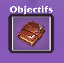

# 🌾 L'écuyer

Il existe sur Nexion un système d'écuyer, un compagnon vous accompagnant dans le jeu, accessible dès que vous avez atteint le niveau de 100 de votre classe.


Une fois le niveau 100 atteint, l'interface de votre écuyer est accessible en cliquant sur le PNJ dédié à l'écuyer au Spawn ou au /warp ecuyer.


.png>)

Par défaut lorsque tu débloques l'écuyer tu as un objectif chaque jour (en fonction de ton niveau tu peux débloquer plusieurs objectifs par jour, 3 maximum).

Dans un objectif tu devras donner entre 1 et 2 ressources différentes à l'écuyer (avec des quantités différentes) pour pouvoir réussir l'objectif. **Pour réussir l'objectif**, l'écuyer doit récupérer la bonne quantité de ressources par lui même, l'objectif se termine automatiquement quand cela est réalisé.

**-> Un objectif réussi donne de l'expérience pour l'écuyer.**

* **Farmeur :** 3% de chance de récupérer une agriculture de base lorsque le joueur la casse. (Blé, patate, carotte, cacao, pastèque, citrouille, nether warts, myrtille, mûres, feuilles de tabac)
* **Tueur de monstres :** 5% de chance de récupérer une bouteille d'expérience lorsqu'un monstre est tué.
* **Mineur** (Si tu utilises Silktouch, la ressource ne peut pas être récupéré par l'écuyer) : 3% de chance de récupérer un minerais lorsqu'un joueur le casse (Opale, Iris, Titane, Random ore, minerais d'exp, minerai de mana)
* **Réparateur :** Répare l'armure, outil, épée en opale (5 minutes à réparer). Tu ne peux réparer qu'un seul item par jour
* **Pilleur :** 5% de chance qu'une explosion double les dommage sur les blocs d'obsidiennes (tous les items en obsidienne, ne fonctionne pas avec les TNT de mana)
* **Monter écuyer :** Vous permet d'être sur les épaules de votre écuyer. (Dès que tu actives l'action, tu es sur les épaules de ton écuyer. Il se désactive s'il y a des ennemis autour. (Il peut être activer au spawn, mais pas dans les autres régions)

### 🟢 Récupérez des ressources de <mark style="color:green;">Farming</mark> :

**Blé, Patate, Carotte, Cacao, Pastèque, Citrouille :** 0.7 exp par item récupéré dans l'écuyer.\
**Nether Warts, Myrtille, Mûres :** 1.1 exp par item récupéré dans l'écuyer.\
**Baie Légendaire, Melon légendaire, Citrouille légendaire :** 3 exp par item récupéré dans l'écuyer.\
**Feuilles de tabac :** 30 exp par item récupéré dans l'écuyer.

### 🔵 Récupérez des ressources du <mark style="color:blue;">Tueur de montres</mark> :

**Bottlexp :** 0.2 exp par item récupéré dans l'écuyer.\
**Ficelle, Os, Chair Putréfié, oeil d'araignée, cuir :** 0.3 exp par item récupéré dans l'écuyer.\
**Ender pearl, poudre de creeper :** 5 exp par item récupéré dans l'écuyer.\
**Cervelet de mort vivant, queue de scorpion, dent de loup :** 20 exp par item récupéré dans l'écuyer.

### 🟡 Récupérez des <mark style="color:yellow;">Minerais</mark> :

**Récupérez un Minerai d'opale :** 3 exp\
**Récupérez un Minerai d'iris :** 5 exp\
**Récupérez un Fragment de titane :** 10 exp\
**Récupérez un Random ore :** 8 exp\
**Récupérez un Minerais de Mana :** 25 exp\
**Récupérez un Minerais d'exp :** 3 exp\
**Récupérez un Random ore gemmes :** 50 exp

### 🟤 <mark style="color:orange;">Réparation</mark> des armures :

**Minerais MineCraft + Opale :** 30 exp donné lorsque tu répares un item en opale avec l'écuyer\
**Iris :** 100 exp donné lorsque tu répares un item en iris avec l'écuyer\
**Titane :** 500 exp donné lorsque tu répares un item en titane avec l'écuyer\
**Gemmes :** 1000 exp donné lorsque tu répares un item gemme avec l'écuyer\
**Légendaire :** 2000 exp donné lorsque tu répares un item légendaire avec l'écuyer

* Niveau 1 : Clique gauche sur un bloc qui possède de durabilité donne la durabilité actuel, pas besoin d'item en particulier. (Pilleur)
* Niveau 2 : 10% de chance de récupérer une bottlexp lorsqu'un monstre est tué. (Tueur de monstre)
* Niveau 3 : 5% de récupérer une agriculture de base lorsque le joueur la casse. (Farmeur)
* Niveau 4 : 5% de l'exp que gagne l'écuyer est donnée à votre classe.
* Niveau 5 : 5% de récupérer un minerai (opale, iris, titane, mana, random ore, minerai d'exp)
* Niveau 6 : Possibilité de donner un nom à votre écuyer
* Niveau 7 : Répare 2 items par jour (Réparateur)
* Niveau 8 : Temps d'activité 2 heures. (Durée de l'activité de l'écuyer sur 24 heures)
* Niveau 9 : 5% de chance de récupérer un loot de mobs. (Tueur de monstre)
* Niveau 10 : 2 objectifs pour l'écuyer.
* Niveau 11 : Répare les stuff, outil, épée en iris 30 minutes. (Réparateur)
* Niveau 12 : 10% de chance qu'une explosion double les dommage sur les blocs d'obsidiennes (pilleur)
* Niveau 13 : 10% de récupérer une agriculture de base lorsque le joueur la casse. (Farmeur)
* Niveau 14 : 15% de chance de récupérer une bottlexp lorsqu'un monstre est tué. (Tueur de monstre)
* Niveau 15 : Commande ./ecuyer débloquée. (Permet d'ouvrir le menu de l'écuyer partout)
* Niveau 16 : 3% de récupérer une agriculture légendaire lorsque le joueur casse une ressource de niveau 2. (Farmeur)
* Niveau 17 : 10% de récupérer un minerai (opale, iris, titane, mana, random ore, minerai d'exp)
* Niveau 18 : 25% de l'exp que gagne l'écuyer est donnée à votre classe.
* Niveau 19 : 8% de chance de récupérer un loot de mobs. (Tueur de monstre)
* Niveau 20 : 15% d'exp bonus pour l'écuyer.
* Niveau 21 : Temps d'activité 4 heures. (Durée de l'activité de l'écuyer sur 24 heures)
* Niveau 22 : Répare les stuff, outil, épée en titane en 2 heures. (Réparateur)
* Niveau 23 : 15% de récupérer une agriculture de base lorsque le joueur la casse. (Farmeur)
* Niveau 24 : 20% de chance qu'une explosion double les dommage sur les blocs d'obsidiennes (pilleur)
* Niveau 25 : Give la bague d'écuyer (Obtenable uniquement comme ça)
* Niveau 26 : 6% de récupérer une agriculture légendaire lorsque le joueur casse une ressource de niveau 2. (Farmeur)
* Niveau 27 : 15% de récupérer un minerai (opale, iris, titane, mana, random ore, minerai d'exp)
* Niveau 28 : 20% de chance de récupérer une bottlexp lorsqu'un monstre est tué. (Tueur de monstre)
* Niveau 29 : Répare 3 items par jour (Réparateur)
* Niveau 30 : 3 objectifs pour l'écuyer
* Niveau 31 : 20% de chance qu'une explosion double les dommage sur tous les blocs possédant de la durabilité. (pilleur)
* Niveau 32 : Temps d'activité 8 heures. (Durée de l'activité de l'écuyer sur 24 heures)
* Niveau 33 : Répare les stuff, épée Gemmes en 4 heures. (Réparateur)
* Niveau 34 : 20% de récupérer une agriculture de base lorsque le joueur la casse. (Farmeur)
* Niveau 35 : 50% de l'exp que gagne l'écuyer est donnée à votre classe.
* Niveau 36 : 13% de chance de récupérer un loot de mobs. (Tueur de monstre)
* Niveau 37 : 5% de récupérer un minerai de random ore gemmes (nouvelle capacité mineur)
* Niveau 38 : 30% de chance qu'une explosion double les dommage sur tous les blocs possédant de la durabilité. (pilleur)
* Niveau 39 : 9% de récupérer une agriculture légendaire lorsque le joueur casse une ressource de niveau 2. (Farmeur)
* Niveau 40 : 30% d'exp bonus pour l'écuyer.
* Niveau 41 : Répare 4 items par jour (Réparation)
* Niveau 42 : 20% de récupérer un minerai (opale, iris, titane, mana, random ore, minerai d'exp)
* Niveau 43 : 30% de récupérer une agriculture de base lorsque le joueur la casse. (Farmeur)
* Niveau 44 : 30% de chance de récupérer une bottlexp lorsqu'un monstre est tué. (Tueur de monstre)
* Niveau 45 : Temps d'activité 12 heures. (Durée de l'activité de l'écuyer sur 24 heures)
* Niveau 46 : 18% de chance de récupérer un loot de mobs. (Tueur de monstre)
* Niveau 47 : 15% de récupérer une agriculture légendaire lorsque le joueur casse une ressource de niveau 2. (Farmeur)
* Niveau 48 : 40% de chance qu'une explosion double les dommage sur tous les blocs possédant de la durabilité. (pilleur)
* Niveau 49 : 100% de l'exp que gagne l'écuyer est donner à votre classe.
* Niveau 50 : Répare les armures légendaire 8 heures (Réparateur)
