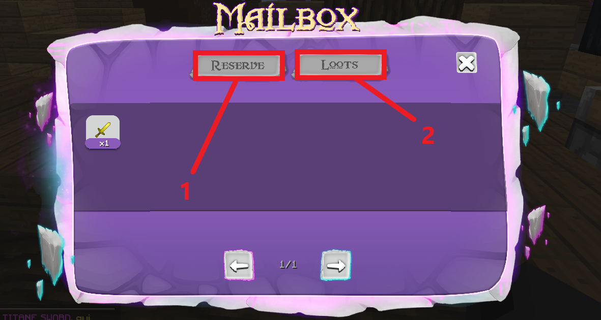
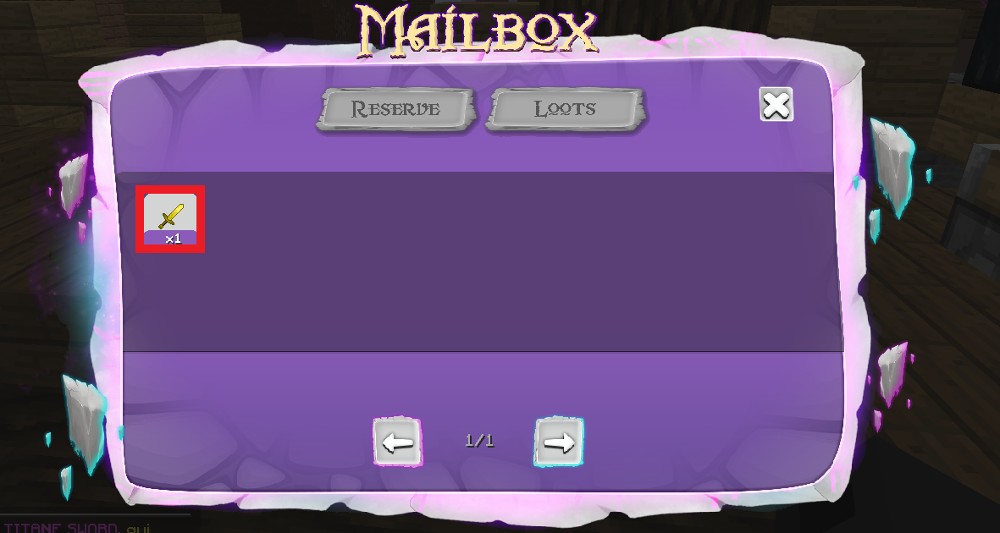

# 📫 Mailbox

## La <mark style="color:purple;">Mailbox</mark> est un espace de stockage où sont stockés vos items&#x20;

La Mailbox est séparée en deux parties, la partie **RESERVE**(<mark style="color:red;">**1**</mark>) et la partie **LOOTS** (<mark style="color:red;">**2**</mark>).

### <mark style="color:green;">**Commande**</mark>

Il existe 3 commandes pour ouvrir la Mailbox :&#x20;

* **/mailbox**&#x20;
* **/reserve** vous ouvre la Mailbox partie **RESERVE**
* **/box** vous ouvre la Mailbox partie **LOOTS**

### <mark style="color:green;">**Les items stockés dans le RESERVE / LOOTS**</mark>&#x20;

Dans la partie **RESERVE** les items qui y seront stockés seront essentiellement les items que tu auras stocké dans ton sac dans le [monde minage](../guide/serveur-minage.md).

Pour la partie **LOOTS** les items qui y seront stockés seront les items non vendus à l'hôtel des ventes, tes achats à l'hôtel des ventes, tes enchères remportées, tes récompenses d'évents ainsi que tes items de vote en cas de manque de slot libre dans ton inventaire lorsque tu récupères tes récompenses de vote sur le serveur faction.


<mark style="color:red;">**ATTENTION :**</mark>&#x20;

À partir de (nombre d'item) items stockés dans la partie **LOOTS**, tu ne pourras plus vendre d'item à l'hôtel des ventes.&#x20;

Cette condition est rajoutée pour éviter que vous stockiez trop d'items dans la Mailbox


### <mark style="color:green;">**Comment récupérer un item stocké dans la Mailbox ?**</mark>&#x20;

Pour récupérer un item dans la Mailbox, tu dois simplement cliquer sur l'item que tu souhaites récupérer et celui-ci se retrouvera directement dans ton inventaire.&#x20;


<mark style="color:orange;">**Remarque :**</mark>&#x20;

Tu ne peux pas récupérer des items dans la Mailbox si ton inventaire est plein&#x20;


