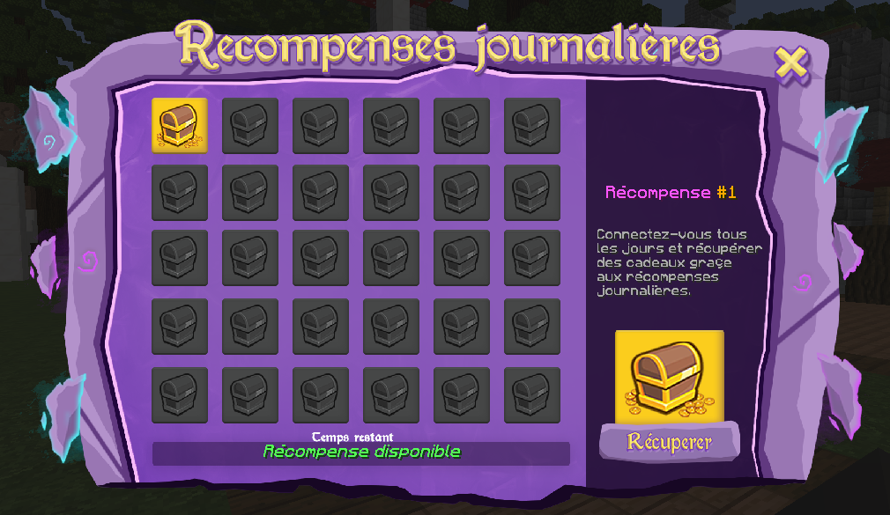

# 🪙 Récompenses journalières

### **Connectez-vous tous les jours pour récupérer des cadeaux grâce aux récompenses journalières**&#x20;

Pour accéder aux récompenses journalières, il suffit de te rendre juste à ta gauche une fois téléporté au spawn et tu y trouveras un pnj nommé <mark style="color:purple;">**Récompenses journalières,**</mark> fais un **CLIQUE-DROIT** sur lui pour lui parler ou tu peux aussi accéder aux récompenses journalières avec la commande <mark style="color:red;">**/reward**</mark>&#x20;

**Interface Récompenses journalières :**&#x20;


<mark style="color:blue;">**Légende :**</mark>&#x20;

1. <mark style="color:blue;">Clique sur</mark> <mark style="color:blue;"></mark><mark style="color:blue;">**RECUPERER**</mark> <mark style="color:blue;"></mark><mark style="color:blue;">pour récupérer ton cadeau.</mark>
2. <mark style="color:blue;">Une fois récupéré, tu devras attendre</mark> <mark style="color:blue;"></mark><mark style="color:blue;">**24 heures**</mark> <mark style="color:blue;"></mark><mark style="color:blue;">avant de pouvoir récupérer un nouveau cadeau, le temps restant sera marqué à cet emplacement.</mark>



<mark style="color:red;">**ATTENTION :**</mark>&#x20;

* Le système de reward fonctionne en fonction de vous et non du serveur, c'est-à-dire que pour récupérer la récompense du jour 2 vous devez récupérer la récompense du jour 1 pour débloquer la récompense du jour 2 ainsi de suite.
* <mark style="color:red;background-color:red;">Si vous ne récupérez pas votre cadeau au bout de</mark> <mark style="color:red;background-color:red;"></mark><mark style="color:red;background-color:red;">**48 heures**</mark> <mark style="color:red;background-color:red;"></mark><mark style="color:red;background-color:red;">votre progression sera reset, vous allez donc devoir recommencer depuis le jour 1.</mark>

