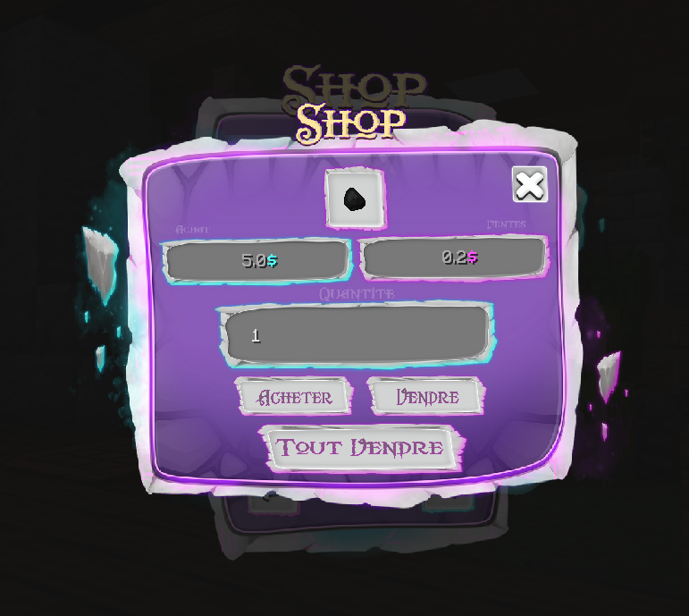

# 🧑🌾 Marchand / Shop

Dans notre univers, il existe des marchands qui te permettent de vendre ou acheter avec eux. Toutes les catégories disponible en jeu sont les suivantes :&#x20;


Tous les marchands sont disponibles au **spawn**, ou avec les commandes **/warp**&#x20;

Vous pouvez utiliser la commande **/warp \<NOM>** pour vous téléporter rapidement comme : **/warp Minerais** ou alors **/warp Agriculture**


#### **💎 Marchand de minerais**

**🌾 Marchand d'agriculture**

**🧱 Marchand de construction**

**🎈 Marchand de décoration**

**🧪 Marchand d'alchimie**

**📦 Marchand divers**

 (1).png>) 


<mark style="color:red;">Attention !</mark> Un [quota](quota.md) est appliquer sur certain PNJ !


