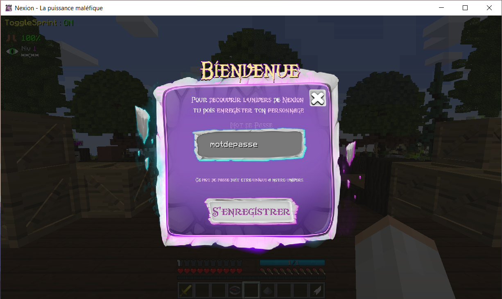
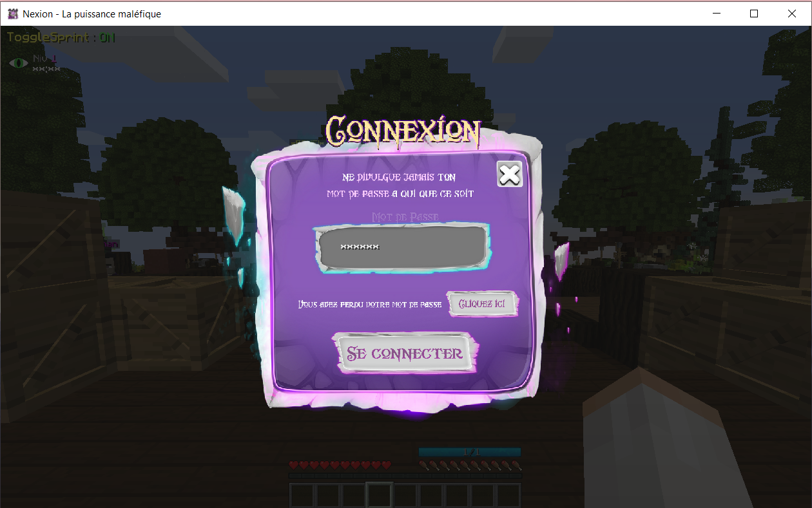
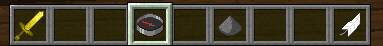

# 🎮 Commencer à jouer

#### Tu as créé ton compte ainsi que téléchargé le launcher, tu es fin prêt pour <mark style="color:purple;">rejoindre l'univers de Nexion et commencer à jouer !</mark>

Maintenant que tu peux lancer le jeu, tu vas arriver sur le menu principale du jeu, il est très simple..

<mark style="color:purple;">**MODE SOLO**</mark> <mark style="color:purple;"></mark><mark style="color:purple;"></mark> <mark style="color:purple;"></mark><mark style="color:purple;">**->**</mark> Monde seul, pouvant permettre de tester, faire ton texture pack, ou toutes autres choses. <mark style="background-color:red;">Attention il n'est pas optimisé pour avoir tous les objets et fonctionnalités pour le solo.</mark>

<mark style="color:purple;">**REJOINDRE L'AVENTURE ->**</mark> Tu pourras rentrer sur un serveur d'accueil (dit LOBBY ou HUB) qui te permettra par la suite de rejoindre les différents serveurs&#x20;

<mark style="color:purple;">**OPTIONS ->**</mark> Uniquement les options de MineCraft.

<mark style="color:purple;">**MULTIJOUEUR ->**</mark>** ** Uniquement pour les administrateurs pour tester nos nouveautés, etc.

Maintenant tu peux rejoindre les serveurs de jeux en cliquant sur <mark style="color:purple;">**REJOINDRE L'AVENTURE**</mark>&#x20;

.png>)


<mark style="color:red;">**ATTENTION :**</mark> Lorsque tu rejoins pour la première fois, pour ta sécurité nous allons te demander de créer un mot de passe pour accéder au serveur de jeu



<mark style="color:red;">**POUR TA SÉCURITÉ :**</mark> Créer un mot de passe unique à nos serveurs, différent que celui que tu utilises sur le site et que tu n'as jamais utilisé ailleurs. Retiens-le ou note le.


 

Une fois connecté, vous pouvez apercevoir dans votre barre de raccourci Minecraft _aussi appelé hot bar_ plusieurs objets vous permettant de faire des actions dans le Lobby d'accueil.

<mark style="color:purple;">**L'EPEE**</mark>**  **<mark style="color:purple;">**->**</mark> <mark style="color:purple;"></mark><mark style="color:purple;"></mark> Elle te permet d'activer le mode PVP du lobby. Tu peux te battre avec les autres joueurs ayant activé aussi leur mode PVP (Les joueurs ayant activé le mode ont une armure en iris)

<mark style="color:purple;">**BOUSSOLE**</mark>**  **<mark style="color:purple;">**->**</mark> <mark style="color:purple;"></mark><mark style="color:purple;"></mark> Elle te permet d'ouvrir le menu de navigation pour aller vers les différents serveurs

<mark style="color:purple;">**POUDRE**</mark>**  **<mark style="color:purple;">**->**</mark> <mark style="color:purple;"></mark><mark style="color:purple;"></mark> Elle te permet de cacher les autres joueurs uniquement dans le lobby. Si tu souhaites être tranquille pour faire le jump du lobby par exemple.

<mark style="color:purple;">**PLUME ->**</mark> <mark style="color:purple;"></mark><mark style="color:purple;"></mark> Je te laisserais découvrir en jeu ce qu'elle peut t'offrir comme petit bonus dans le Lobby. Rien d'incroyable, Ne te sens pas pousser des ailes !

&#x20;                 ~~---------------------------------------------------------------------------~~

#### Si tu fais un ( CLIQUE DROIT ) sur la 🧭 <mark style="color:purple;">BOUSSOLE</mark> tu pourras apercevoir le menu de navigation. Il t'ouvre plusieurs univers. Il est bien de les connaître et de savoir où ils t'emmènent.

<mark style="color:purple;">**DEV**</mark>**  **<mark style="color:purple;">**->**</mark> <mark style="color:purple;"></mark><mark style="color:purple;"></mark> En général, personne n'y a accès en dehors du staff. **** Le serveur de développement utile pour nos tests, nos futurs mise-à-jours. Si jamais un jour tu as l'honneur de rejoindre ce serveur c'est que tu as été tiré au sort à notre demande pour ton avis sur un nouveau système ou un test.&#x20;

<mark style="color:purple;">**REJOINDRE L'EVENT**</mark>**  **<mark style="color:purple;">**->**</mark> <mark style="color:purple;"></mark><mark style="color:purple;"></mark> Le serveur événement, un serveur regroupant plusieurs mini-jeux MineCraft, permettant de te défouler, et de gagner des récompenses en gagnant les événements organisé par notre staff.

<mark style="color:purple;">**MINAGE 01 & MINAGE 02**</mark>**  **<mark style="color:purple;">**->**</mark> <mark style="color:purple;"></mark><mark style="color:purple;"></mark> Les serveurs minages te permettent de miner et de récupérer des ressources, tu auras plus d'informations dans l'onglet [serveur-minage.md](../guide/serveur-minage.md "mention")

<mark style="color:purple;">**REJOINDRE LE SERVEUR FACTIONS**</mark>**  **<mark style="color:purple;">**->**</mark> <mark style="color:purple;"></mark><mark style="color:purple;"></mark> Le serveur faction, te permettant de rejoindre notre grand univers et rencontrer la communauté de joueurs.

