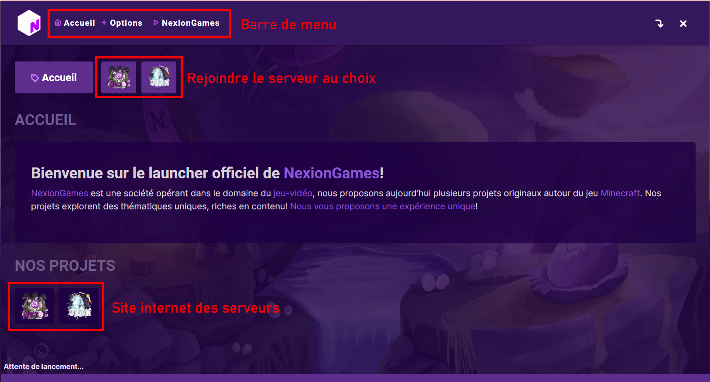
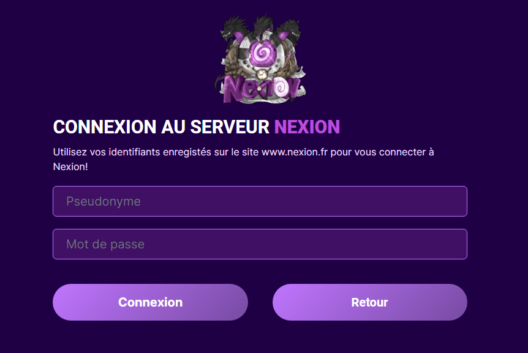

# 📥 Téléchargement

#### Après la création de ton compte, il ne te manque plus qu'à installer le jeu pour <mark style="color:purple;">rejoindre l'univers de Nexion et commencer à jouer !</mark>


Mini vidéo de tutoriel pour installer et jouer sur Nexion.


En premier temps, tu dois te connecter sur le site de [<mark style="color:purple;">**nexion.fr**</mark>](https://nexion.fr/) et rejoindre le page suivante

Ensuite, sur la page [<mark style="color:purple;">**JOUER**</mark> ](https://nexion.fr/join)du site internet, tu dois sélectionner ton système d'exploitation. Seulement **Windows** et **MAC** sont disponibles. _Nous refusons l'accès à la distribution Linux afin d'éviter les failles de sécurité._

.png>)

Maintenant, tu as dû télécharger un setup du <mark style="color:purple;">**Launcher NexionGames**</mark> tu peux cliquer dessus et l'ouvrir cela va t'installer uniquement le launcher.

Lorsque tu lances le téléchargement du setup, il va s'installer et te permettre d'avoir le launcher.

Une fois le téléchargement du setup fini, tu peux l'exécuter. Il s'ouvre souvent seul la première fois.\
**Si jamais, il se trouve souvent sur le bureau**, si tu ne le trouves pas tu peux aller le rechercher.&#x20;

 

Maintenant, tu lances le launcher pour la première fois. Tu vas arriver sur le menu du launcher, n'aies pas peur tout est très simple, encore plus simple que sur le launcher de MineCraft.

.png>)

#### Expliquons maintenant, la barre de menu à côté du logo de <mark style="color:purple;">NexionGames.</mark>&#x20;

**ACCUEIL** -> La page principale du Launcher\
**OPTIONS** -> Espace de configuration : le configurateur de ram allouée au jeu\
**NEXIONGAMES** -> Ouvre le site de NexionGames : [<mark style="color:purple;">www.nexiongames.com</mark>](https://nexiongames.com)<mark style="color:purple;"></mark>

#### Expliquons maintenant, comment rejoindre le menu de <mark style="color:purple;">Nexion</mark>.

C'est très simple, en dessous du menu tu as trois boutons : **Accueil |** **Nexion |** **Orion**\
****<mark style="color:purple;">**Pour rejoindre l'univers de Nexion**</mark>, il te suffira simplement de cliquer sur Nexion.


Attention à ne pas confondre avec les deux boutons en dessous du texte : **Nos projets** qui permettent d'aller sur le site du serveur



Tu peux apercevoir les articles et dernières informations du serveur, idéale pour se tenir au courant des nouveautés ! Les articles viennent du site internet de : **** [<mark style="color:purple;">**nexion.fr**</mark>](https://nexion.fr) <mark style="color:purple;">****</mark>&#x20;


![Page du serveur Nexion, tu peux cliquer sur  \[ -> Connexion à Nexion \] pour rejoindre l'aventure !](<../.gitbook/assets/screen launcher Nexion.png>)

Après avoir cliqué sur le bouton <mark style="color:purple;">**\[ -> Connexion à Nexion ]**</mark> Tu vas devoir te connecter avec tes identifiants que tu as créé précédemment dans notre tutoriel pour la [creation-du-compte.md](creation-du-compte.md "mention")

![Ensuite tu peux cliquer sur le bouton \[ -> Jouer à Nexion \]](../.gitbook/assets/Screenshot\_1.png)

Une fois cela fait, tu n'as plus qu'à lancer le jeu en cliquant sur le bouton <mark style="color:purple;">**\[ -> Jouer à Nexion ]**</mark>

Si c'est la première fois que tu lances le launcher tu auras une mise à jour qui peut être longue ne t'en fais pas c'est tout à fait normal, tu dois télécharger tout l'univers de Nexion. Lorsqu'il aura finit le téléchargement le launcher se fermera automatiquement et le jeu se lancera.

**Vous aurez ensuite le choix entre jouer en solo ou rejoindre le serveur pour jouer en multijoueur.**&#x20;
