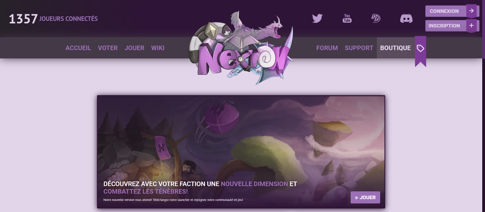
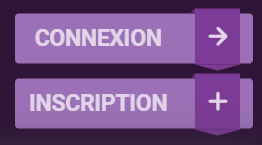
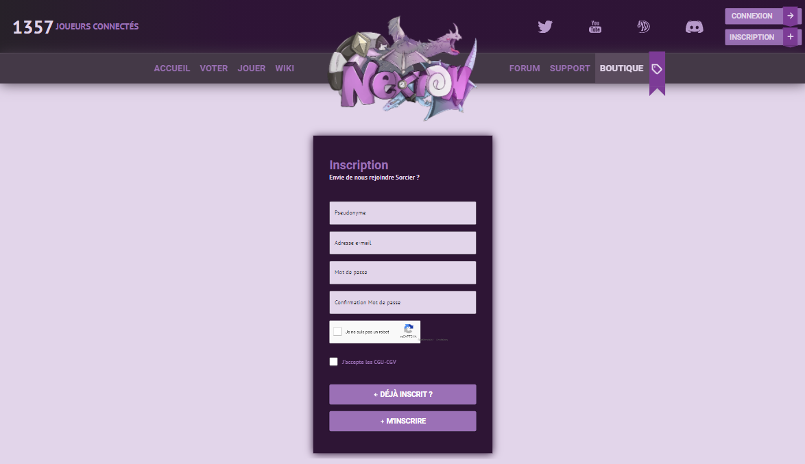
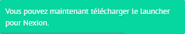

# 👤 Création du compte

#### Avant de te lancer dans l'aventure .. Tu dois créer ton compte <mark style="color:purple;">**gratuitement et sans avoir de**</mark> <mark style="color:purple;"></mark><mark style="color:purple;">compte MineCraft Premium !</mark>

Tu peux jouer sur Nexion sans avoir un compte Minecraft Premium, nous ne sommes en aucun cas affiliés à Mojang. Tu dois aller sur le site <mark style="color:purple;">**Nexion.fr**</mark> pour t'inscrire et créer un compte. N'attendons plus, commençons maintenant la création de ton compte.&#x20;


Pour la création de ton compte, tu peux cliquer sur le bouton **INSCRIPTION**

➜ Sinon, tu peux directement te connecter avec le bouton **CONNEXION**


 


:arrow\_up:En cliquant sur ce bouton, tu arrives directement sur la page pour t'inscrire sur le site de <mark style="color:purple;">**nexion.fr**</mark>



Il est important de le préciser, toutes vos informations personnelles ne seront **jamais vendues ou utilisées à des fins commerciales**. Nous sommes fidèles à la sécurité de nos utilisateurs et au respect de vos données.



Ainsi pour renforcer la sécurité de votre compte, vous devez obligatoirement utiliser un mot de passe unique que vous n'avez jamais utilisé auparavant sur un autre site.&#x20;

Nous vous conseillons d'**utiliser un mot de passe généré aléatoirement**, il existe plusieurs générateurs de mot de passe disponibles sur internet, vous pouvez chercher par vous même, ou cliquer sur celui que nous vous proposons ci-dessous.

· **Dashlane** - [https://www.dashlane.com/fr/features/password-generator](https://www.dashlane.com/fr/features/password-generator)


