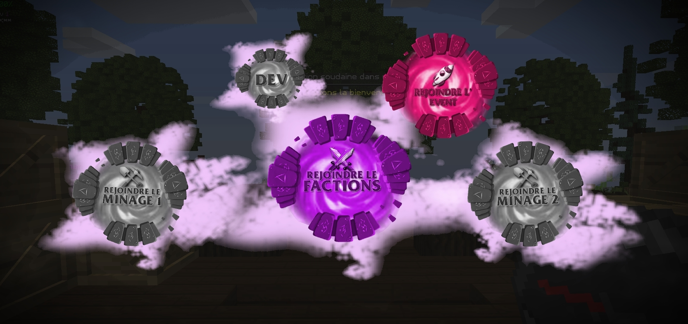

# 🎮 3. Commencer à jouer

## Rejoins l'univers de Nexion et commence à jouer !

Maintenant que tu peux lancer le jeu, tu vas arriver sur le menu principale du jeu. Passons en revu les fonctionnalités du menu principale :

👤 **Monde solo** **->** C'est le monde pour jouer seul. Celui-ci n'est pas optimisé donc toutes les fonctionnalités présente sur le serveur ne sont pas dans ce monde.

🧙‍♂️ **Rejoindre l'aventure ->** Tu pourras rentrer sur un serveur d'accueil (appelé "LOBBY" ou "HUB") qui te permettra par la suite de rejoindre les différents serveurs comme le serveur Factions.

⚙️ **Engrenage grise ->** Pour gérer les options de MineCraft.

⚙️ **Engrenage violette ->** Pour gérer les options intégrés sur Nexion

Ainsi qu'une barre avec plusieurs bouton permettant d'afficher nos réseaux et des liens utiles.

<figure><figcaption></figcaption></figure>

## Enregistre ton compte en jeu

Lorsque tu rejoins pour la première fois, pour ta sécurité nous allons te demander de créer un mot de passe pour accéder au serveur de jeu. Celui-ci doit être différent que sur le site pour protéger un maximum ton compte.

<figure><figcaption></figcaption></figure>

## Découvrons la liste des serveurs

En faisant un **(CLIQUE DROIT)** sur la **🧭 Boussole** en jeu tu pourras apercevoir le menu de navigation. Il t'ouvre plusieurs univers, découvrons cela ensemble :

🏰 **Rejoindre le Factions ->** Le serveur faction, te permettant de rejoindre notre grand univers et rencontrer la communauté de joueurs.

🌍 **Rejoindre le Minage1 ou Minage2 ->** Les serveurs minages te permettent de miner et de récupérer des ressources, tu auras plus d'informations dans l'onglet [Broken link](broken-reference "mention")

🚧 **Dev ->** Le serveur de développement utile pour nos tests, nos futurs mise-à-jours. Si jamais un jour tu as l'honneur de rejoindre ce serveur c'est que tu as été tiré au sort à notre demande pour ton avis sur un nouveau système ou un test.&#x20;

🚀 **Rejoindre l'évent ->** Le serveur événement, un serveur regroupant plusieurs mini-jeux MineCraft, permettant de te défouler, et de gagner des récompenses en gagnant les événements organisé par notre staff.

