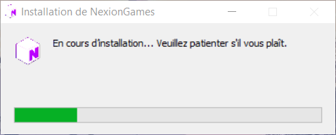
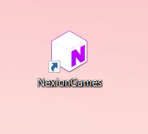

# 📥 2. Télécharger le launcher

## Passons à l'installation du launcher !

Sur la page [<mark style="color:purple;">**JOUER**</mark> ](https://nexion.fr/join)du site internet, tu dois sélectionner ton système d'exploitation. Seulement **Windows** et **MAC** sont disponibles. _Nous refusons l'accès à la distribution Linux afin d'éviter les failles de sécurité._ N'attendons plus, commençons maintenant l'installation du launcher en cliquant sur le bouton ci-dessous.



## <mark style="color:purple;">\[ETAPE 1]</mark> Télécharger le setup du launcher

En téléchargeant le launcher tu dois installer ce qu'on appelle un **SETUP** du launcher, c'est une application pour lancer notre launcher. En cliquant sur le système d'exploitation de ton choix, tu vas télécharger notre application.

<figure><figcaption></figcaption></figure>

Lorsque tu lances le téléchargement du setup, il va s'installer et te permettre d'avoir le launcher.

## <mark style="color:purple;">\[ETAPE 2]</mark> Ouvrir le launcher NexionGames

Une fois le téléchargement du setup fini, tu peux ouvrir le launcher. Il s'ouvre souvent seul la première fois. I**l se trouve souvent sur le bureau**, si tu ne le trouves pas tu peux aller le rechercher.&#x20;

 

Maintenant, tu lances le launcher pour la première fois. Tu vas arriver sur le menu du launcher. Expliquons maintenant, la barre de menu tout en haut du launcher.

**ACCUEIL** -> La page principale du launcher\
**OPTIONS** -> Espace de configuration pour configurer la ram allouée au jeu\
**NEXIONGAMES** -> Ouvre le site de NexionGames : [<mark style="color:purple;">www.nexiongames.com</mark>](https://nexiongames.com)


Tu peux apercevoir les articles et dernières informations du serveur, idéale pour se tenir au courant des nouveautés ! Les articles viennent du site internet de : [<mark style="color:purple;">**nexion.fr**</mark>](https://nexion.fr)&#x20;


## <mark style="color:purple;">\[ETAPE 3]</mark> Jouer avec le launcher

Après avoir cliqué sur le bouton <mark style="color:purple;">**\[->Connexion à Nexion]**</mark> Tu peux te connecter avec les identifiants que tu as créé précédemment avec la création de ton compte.

![Ensuite tu peux cliquer sur le bouton \[ -> Jouer à Nexion \]](../../.gitbook/assets/Screenshot\_1.png)

Une fois cela fait, tu n'as plus qu'à lancer le jeu en cliquant sur le bouton <mark style="color:purple;">**\[->Jouer à Nexion]**</mark>

Si c'est la première fois que tu lances le launcher tu auras une mise à jour qui peut être longue ne t'en fais pas c'est tout à fait normal, tu dois télécharger tout l'univers de Nexion. Lorsqu'il aura finit le téléchargement le launcher se fermera automatiquement et le jeu se lancera.


<mark style="color:red;">**POUR TOUT PROBLEME DE TELECHARGEMENT DE LAUNCHER !**</mark>

Nous avons un guide pour t'aider si jamais tu rencontres un problèmes lors du téléchargement du jeu en cliquant sur le bouton suivant : [<mark style="color:red;">**\[->Problème launcher\]**</mark>](../../aide-faq/comment-lancer-le-launcher/guide-launcher.md)

